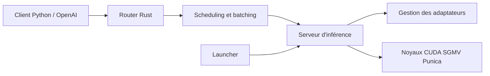

# predibase/lorax

> Serveur d'inférence qui sert des milliers d'adaptateurs LoRA sur un seul GPU, pour équipes MLOps.

## Le problème
Servir un modèle affiné par client ou par tâche oblige à dédier un GPU à chacun, ce qui fait exploser la facture.

## Ce que ça fait vraiment
Un modèle de base (Llama, Mistral, Qwen) reste en mémoire ; l'adaptateur LoRA demandé est chargé à la volée depuis HuggingFace, Predibase ou un disque, sans bloquer les autres requêtes. Le batching continu mélange des requêtes visant des adaptateurs différents, et les adaptateurs migrent entre GPU et CPU selon la demande. L'API est REST, compatible OpenAI pour le chat (l'adaptateur se passe dans `model`), avec client Python.

## Comment c'est branché


## Essayer
```bash
model=mistralai/Mistral-7B-Instruct-v0.1
volume=$PWD/data
docker run --gpus all --shm-size 1g -p 8080:80 -v $volume:/data \
    ghcr.io/predibase/lorax:main --model-id $model
pip install lorax-client
```

## Coût et pièges
GPU Nvidia génération Ampere ou plus, CUDA 11.8+, Linux, nvidia-container-toolkit. Le README recommande l'image Docker pour éviter de compiler les noyaux CUDA. 186 issues ouvertes.

## Ce que ce n'est pas
Ce n'est pas un outil d'entraînement : il sert des adaptateurs déjà produits (PEFT, Ludwig). Il ne remplace pas un serveur généraliste si tu n'as qu'un seul modèle affiné.

## Alternatives
Aucune alternative n'est nommée dans le README (le serveur d'origine dont il dérive n'y est pas cité).

## Pour toi
À adopter si tu dois servir beaucoup de variantes LoRA à faible coût : licence Apache-2.0, push récent, Docker et Helm fournis ; sinon inutile.
