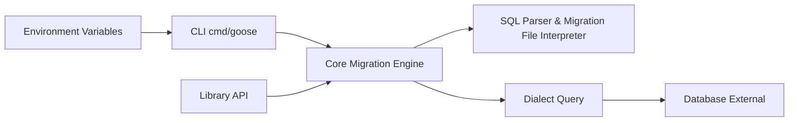

# pressly/goose

> Outil de migrations de schéma de base de données, en CLI et bibliothèque Go.

## Le problème
Faire évoluer un schéma SQL sur plusieurs environnements sans suivi de version mène à des bases divergentes.

## Ce que ça fait vraiment
Migrations en SQL annoté (`-- +goose Up` / `Down`) ou en fonctions Go, suivies dans la table `goose_db_version`.
Commandes up, up-to, down, redo, reset, status, version, create, fix, validate.
Pilotes Postgres, MySQL, SQLite, Spanner, MSSQL, ClickHouse, Redshift, YDB, Turso… ; migrations embarquées via `embed`.
Transactions par défaut, substitution de variables d'environnement, migrations hors ordre avec `-allow-missing`.

## Comment c'est branché


## Essayer
```bash
go install github.com/pressly/goose/v3/cmd/goose@latest
goose sqlite3 ./foo.db create init sql
goose sqlite3 ./foo.db up
goose sqlite3 ./foo.db status
```

## Coût et pièges
Gratuit ; migrations Go exigent de compiler ton propre binaire goose.
MySQL : `parseTime` et `multiStatements` obligatoires. Licence non identifiée par GitHub.

## Ce que ce n'est pas
Pas un ORM ni un générateur de migrations à partir de modèles.
Bibliothèque en Go uniquement ; en CLI, utilisable pour tout projet.

## Alternatives
Aucune alternative nommée dans le README.

## Pour toi
À surveiller : une CLI de migrations SQL pure, utile pour versionner le schéma d'un entrepôt ou feature store hors écosystème Python ; vérifier la licence.
