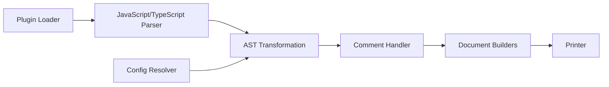

# prettier/prettier

> Formateur de code à style imposé pour JavaScript, TypeScript, CSS, HTML, JSON, Markdown, YAML et d'autres langages.

## Le problème
Les revues de code s'enlisent dans des remarques de style, et chaque développeur formate à sa façon.

## Ce que ça fait vraiment
Il parse le code, puis le réimprime avec ses propres règles en tenant compte de la longueur de ligne maximale, en coupant les lignes si nécessaire. Il tourne à l'enregistrement dans l'éditeur, en hook de pré-commit ou en CI. Le README liste les langages pris en charge et renvoie vers la doc pour l'installation, les options, la CLI et l'API.

## Comment c'est branché

Attention : le texte d'architecture fourni est un guide pour dessiner un schéma, pas une description tirée du code ; les composants ci-dessus viennent de la liste du graphe.

## Essayer
Aucune commande documentée dans le README (renvoi vers la documentation d'installation et le playground en ligne).

## Coût et pièges
Gratuit. Le mode de distribution n'est pas précisé dans le README, seulement via des liens. Beaucoup d'issues ouvertes (1 434).

## Ce que ce n'est pas
Ce n'est pas un linter : il ne détecte pas les bugs, il réécrit seulement la mise en forme. Ses choix de style sont peu configurables par conception.

## Alternatives
Aucune alternative nommée dans le README.

## Pour toi
À adopter : un dépôt MLOps contient du YAML, du JSON et du Markdown, et un hook de pré-commit supprime les débats de style sans effort.

