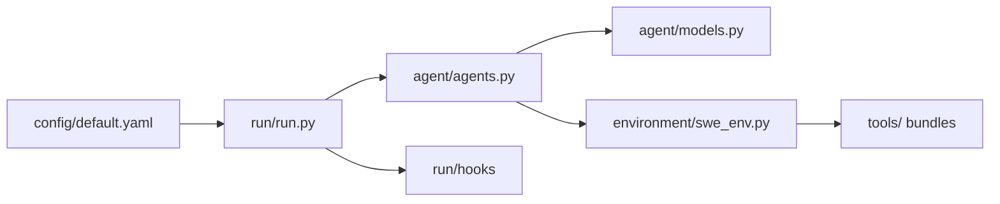

# princeton-nlp/SWE-agent

> Agent en ligne de commande qui laisse un LLM corriger des issues GitHub par outils shell, pour la recherche.

## Le problème
Faire résoudre par un modèle des tickets sur de vrais dépôts, et mesurer ses résultats, demande une boucle agent/outils/exécution reproductible.

## Ce que ça fait vraiment
- Un fichier YAML fixe modèle, prompts, outils et environnement ; le modèle est au choix.
- La boucle d'agent (`agents.py`) appelle le modèle, exécute les actions dans un environnement de dépôt (`swe_env.py`) et itère jusqu'à soumission.
- Modes unitaire, batch et rejeu ; hooks pour appliquer un patch, évaluer sur SWE-bench ou ouvrir une pull request.
- Un inspecteur local de trajectoires ; mode EnIGMA pour des défis CTF (version 0.7 conseillée).

## Comment c'est branché

## Essayer
Aucune commande dans le README ; il renvoie à la documentation https://swe-agent.com (installation, hello world, SWE-bench) et à un Codespaces.

## Coût et pièges
Clé d'API du modèle choisi, à ta charge ; exécution potentiellement en conteneur. Identité GitHub non renseignée (licence, étoiles, dates), donc licence à vérifier avant tout usage.

## Ce que ce n'est pas
Ce n'est plus le projet prioritaire : le README indique que mini-swe-agent l'a remplacé et le recommande. Ce n'est pas un outil de sécurité offensive prêt à l'emploi : EnIGMA attend sa mise à jour pour la version 1.0.

## Alternatives
mini-swe-agent, recommandé par le README, plus simple pour des performances comparables.

## Pour toi
À surveiller : référence utile pour comprendre un agent de code piloté par configuration, mais pars plutôt de mini-swe-agent pour un usage neuf.
