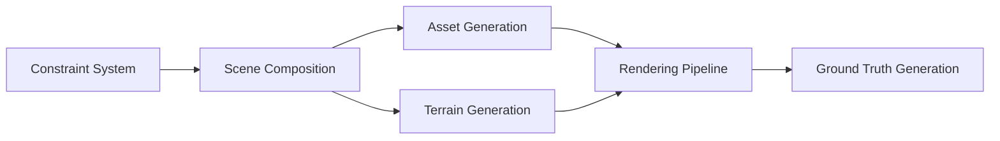

# princeton-vl/infinigen

> Générateur procédural de mondes 3D photoréalistes pour la recherche en vision et en simulation.

## Le problème
Les données 3D annotées (nature, intérieurs, objets articulés) sont chères à produire à la main pour entraîner des modèles.

## Ce que ça fait vraiment
Génère des scènes procédurales (nature, intérieurs, assets articulés pour simulateurs) avec vérité terrain étendue, export vers OBJ ou OpenUSD, simulation de fluides. Le README est surtout un index vers la documentation hébergée et vers des versions stables par thème. Architecture décrite : système de contraintes, génération de terrain et d'assets, pipeline de rendu, dépendance à Blender et CUDA.

## Comment c'est branché

## Essayer
Aucune commande documentée dans le README : les guides d'installation et « Hello World / Hello Room » sont renvoyés vers la documentation hébergée.

## Coût et pièges
Gratuit. Le matériel requis n'est pas détaillé dans le README ; le rendu implique Blender et GPU d'après le graphe. Il faut choisir la bonne branche stable (nature, indoors, articulated).

## Ce que ce n'est pas
Pas un modèle génératif appris : la génération est procédurale. Le README ne donne pas de quick start.

## Alternatives
Aucune alternative nommée dans le README.

## Pour toi
À surveiller : utile si tu as besoin de données synthétiques 3D annotées pour la vision ou la robotique, sinon hors de ton périmètre.

