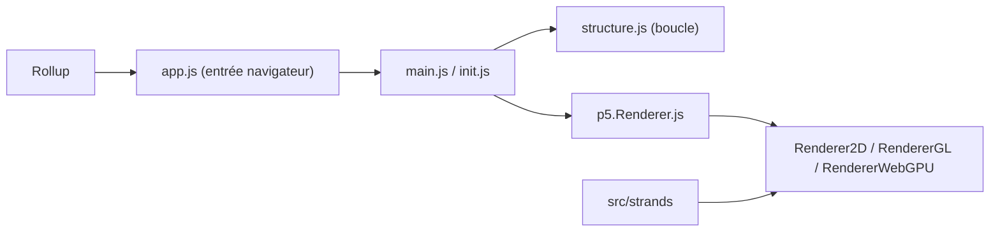

# processing/p5.js

> Bibliothèque JavaScript de codage créatif accessible, pour artistes, designers, enseignants et débutants.

## Le problème
Dessiner et animer dans un navigateur en JavaScript brut est laborieux pour des non-spécialistes.

## Ce que ça fait vraiment
Fournit un cycle `setup()`/`draw()` et des API de dessin, interaction, média, données, typographie et accessibilité, avec rendu Canvas 2D, WebGL et WebGPU. Un sous-système `p5.strands` traduit une API de shaders en GLSL/WGSL. Le projet est soutenu par la Processing Foundation, avec une direction tournante ; il n'accepte pas de contributions entièrement générées par IA.

## Comment c'est branché


## Essayer
```js
function setup() {
  createCanvas(400, 400);
  background(255);
}
function draw() {
  circle(mouseX, mouseY, 80);
}
```

## Coût et pièges
Gratuit. LGPL-2.1 : obligations sur les modifications de la bibliothèque. Maintenu surtout par des bénévoles, délais de réponse variables.

## Ce que ce n'est pas
Ce n'est pas une bibliothèque de visualisation de données : elle dessine, sans notion de graphique statistique.

## Alternatives
Aucune alternative nommée dans le README (Processing est cité comme inspiration).

## Pour toi
Surveiller : utile pour des visualisations génératives ou pédagogiques, pas pour de la dataviz analytique.

