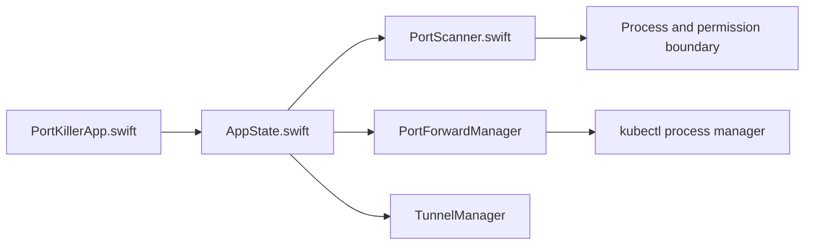

# productdevbook/port-killer

> Application de bureau qui liste les ports TCP en écoute et tue les processus, pour développeurs.

## Le problème
Un serveur de dev oublié occupe un port et il faut retrouver quel processus le tient. Les `kubectl port-forward` qui tombent en silence font perdre du temps.

## Ce que ça fait vraiment
Découvre les ports TCP en écoute, filtre par numéro ou processus, arrête un processus (doux ou forcé), gère favoris et ports surveillés avec notifications. Gère aussi des sessions `kubectl port-forward` avec reconnexion automatique et affiche les processus `cloudflared` locaux. Trois implémentations indépendantes : Swift/SwiftUI (macOS), C#/WPF (Windows), Python (Linux), plus une bibliothèque Rust. Le sous-système Kubernetes est le plus abouti sur macOS.

## Comment c'est branché


## Essayer
```bash
brew install --cask productdevbook/tap/portkiller
```
Windows : télécharger le `.zip` depuis les Releases GitHub.

## Coût et pièges
Gratuit, MIT. Les fonctions Kubernetes supposent `kubectl` installé ; les tunnels supposent `cloudflared`. Installation Linux : script `install.sh`, peu documenté dans le README.

## Ce que ce n'est pas
Pas un scanner réseau : il ne regarde que les ports locaux. Les trois plateformes ne partagent pas de code d'interface, leurs fonctions peuvent différer.

## Alternatives
Aucune alternative nommée dans le README.

## Pour toi
Adopter si tu jongles avec des port-forward vers des clusters ML : gratuit, léger, et le geste économisé est quotidien.

