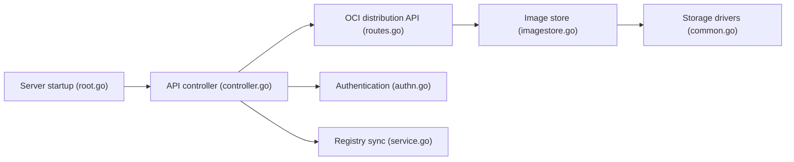

# project-zot/zot

> Registre d'images OCI neutre vis-à-vis des fournisseurs ; fiche minimale, README quasi vide.

## Le problème
Non documenté dans le README : celui-ci se limite à un slogan et à un lien vers zotregistry.dev.

## Ce que ça fait vraiment
Selon l'architecture tirée du code : serveur de registre OCI (API de distribution), authentification, stockage d'images avec pilotes de stockage, métadonnées, réplication (sync), recherche et analyse de CVE, rétention, extensions d'événements, plus clients CLI, exporteur de métriques et outil de benchmark.

## Comment c'est branché

## Essayer
Aucune commande documentée dans le README ; voir https://zotregistry.dev.

## Coût et pièges
Non documenté dans le README.

## Ce que ce n'est pas
Pas une documentation d'installation : le README ne dit rien du déploiement. Le qualificatif « prêt pour la production » est une affirmation de l'auteur, non vérifiée ici.

## Alternatives
Aucune alternative nommée dans le README.

## Pour toi
À surveiller : un registre OCI léger avec recherche de CVE est pertinent en MLOps, mais il faut lire la documentation externe pour juger.

