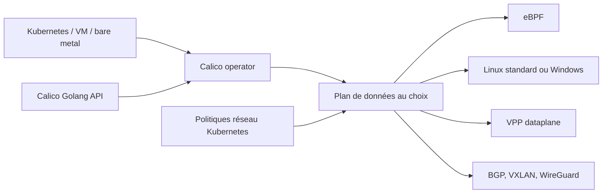

# projectcalico/calico

> **Networking and security policy for Kubernetes clusters, containers, VMs and bare metal.**

## The problem

Without a dedicated networking layer, a Kubernetes cluster has no consistent pod-to-pod
routing across distributions and clouds, and no way to enforce fine-grained access rules
between workloads. The README does not spell this gap out; it assumes it.

## What it actually does

Calico provides the container data plane and enforces Kubernetes network policy. The README
advertises a choice of data planes — eBPF, standard Linux, Windows and VPP — and operation
across multiple distributions, multiple clouds, bare metal and VMs. On the networking side it
names BGP, VXLAN and service advertisement; on the security side, granular access controls
and WireGuard encryption. The repository also groups sibling components the project
maintains: the Golang API, the operator, the VPP data plane and a BIRD fork. The README
claims 8M+ nodes daily across 166 countries and over 200 contributors; those figures are not
sourced in the file.

## How it is wired



The README describes no internal architecture: this diagram is inferred only from the
components it names — the operator, the Golang API, the VPP data plane, BIRD — and from the
list of data planes and networking mechanisms it advertises. Nothing in the file says how
these pieces talk to each other.

## Trying it

```bash
# No installation command is documented in the README.
# It only links out to an external quickstart:
# https://projectcalico.docs.tigera.io/getting-started/kubernetes/quickstart
```

A badge also points at a `tigera-operator` Helm package on ArtifactHub, but the README never
writes the matching command. Nothing is reconstructed here.

## Cost and traps

The code is Apache-2.0 and the README announces no API key, no account and no bill. The real
prerequisite is a cluster you administer: deployment goes through an operator and a data
plane you must choose, and that choice — eBPF, Linux, Windows, VPP — commits you operationally
for the long run. The README documents neither supported Kubernetes versions, nor resource
requirements, nor the constraints of WireGuard encryption. The project is created and
maintained by Tigera, which sells a commercial offering around it; the README does not say
where the open-source version stops.

## What it is not

This is not something you try locally with one command: it is an infrastructure component
installed into a cluster, with direct impact on traffic. It is not an observability product
nor an application firewall either. And the README itself is not technical documentation: it
is a community landing page, saturated with promotional adjectives — "seamlessly",
"optimized" — and without a single command. All the useful material lives outside the
repository, on Tigera's site.

## Alternatives

- **cilium/cilium** — the other major eBPF CNI for Kubernetes; prefer it when the eBPF data
  plane and network observability are the core need.
- **cilium/tetragon** — complementary rather than alternative: runtime observability and
  policy enforcement, not pod routing.

Neither name appears in Calico's README; both come from the catalogue neighbours.

## For you

For a data / AI / MLOps profile, Calico is not a tool you pick, it is a component you inherit
from whichever cluster runs your training jobs and inference services. Knowing it is there —
and that the NetworkPolicies blocking access to a bucket or a model endpoint go through it —
is worth the read; installing it belongs to the platform team.
