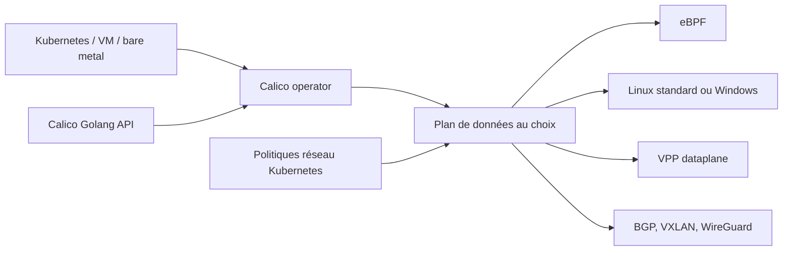

# projectcalico/calico

> **Réseau et politiques de sécurité pour clusters Kubernetes, conteneurs, VM et bare metal.**

## Le problème

Sans couche réseau dédiée, un cluster Kubernetes n'a ni routage entre pods cohérent entre
distributions et clouds, ni moyen d'appliquer des règles d'accès fines entre charges de
travail. Le README ne détaille pas ce manque, il le présuppose.

## Ce que ça fait vraiment

Calico fournit le plan réseau des conteneurs et l'application des politiques réseau
Kubernetes. Le README annonce plusieurs plans de données au choix — eBPF, Linux standard,
Windows et VPP — et un fonctionnement sur plusieurs distributions, plusieurs clouds, bare
metal et VM. Côté réseau, il cite BGP, VXLAN et l'annonce de services ; côté sécurité, des
contrôles d'accès granulaires et le chiffrement WireGuard. Le dépôt rassemble aussi des
composants voisins maintenus par le projet : l'API Go, l'opérateur, le plan de données VPP
et un fork de BIRD. Le README revendique plus de 8 millions de nœuds par jour dans 166 pays
et plus de 200 contributeurs ; ces chiffres ne sont pas sourcés dans le fichier.

## Comment c'est branché



Le README ne décrit aucune architecture interne : ce schéma se déduit seulement des
composants qu'il nomme — l'opérateur, l'API Go, le plan de données VPP, BIRD — et de la liste
des plans de données et des mécanismes réseau annoncés. Rien dans le fichier ne précise
comment ces pièces communiquent entre elles.

## Essayer

```bash
# Aucune commande d'installation n'est documentée dans le README.
# Il renvoie uniquement vers un quickstart externe :
# https://projectcalico.docs.tigera.io/getting-started/kubernetes/quickstart
```

Le README pointe aussi un paquet Helm `tigera-operator` sur ArtifactHub via un badge, mais
n'écrit pas la commande correspondante. Ne rien reconstruire.

## Coût et pièges

Le code est sous Apache-2.0 et le README n'annonce ni clé d'API, ni compte, ni facture. Le
prérequis réel est un cluster à administrer : le déploiement passe par un opérateur et un
plan de données à choisir, et ce choix — eBPF, Linux, Windows, VPP — engage l'exploitation
sur la durée. Le README ne documente ni les versions de Kubernetes supportées, ni les
ressources nécessaires, ni les contraintes du chiffrement WireGuard. Le projet est créé et
maintenu par Tigera, qui vend une offre commerciale autour : le README ne dit pas où s'arrête
la version open source.

## Ce que ce n'est pas

Ce n'est pas un outil qu'on essaie en local en une commande : c'est une brique d'infra
installée dans un cluster, avec un impact direct sur le trafic. Ce n'est pas non plus un
produit d'observabilité ni un pare-feu applicatif. Et le README lui-même n'est pas de la
documentation technique : c'est une page d'accueil de communauté, saturée d'adjectifs
promotionnels — « seamlessly », « optimized » — et sans une seule commande. Toute la matière
utile est hors dépôt, sur le site de Tigera.

## Alternatives

- **cilium/cilium** — l'autre grand CNI eBPF pour Kubernetes ; à préférer si le plan de
  données eBPF et l'observabilité réseau sont le cœur du besoin.
- **cilium/tetragon** — complémentaire plutôt qu'alternatif : observabilité et application de
  politiques à l'exécution, pas du routage de pods.

Aucun de ces noms ne figure dans le README de Calico ; ils viennent des voisins du catalogue.

## Pour toi

Pour un profil data / IA / MLOps, Calico n'est pas un outil qu'on choisit, c'est un composant
qu'on subit ou qu'on hérite du cluster qui fait tourner les entraînements et les services
d'inférence. Savoir qu'il est là — et que les NetworkPolicy qui bloquent l'accès à un bucket
ou à un endpoint de modèle passent par lui — vaut la lecture ; l'installer relève de l'équipe
plateforme.
