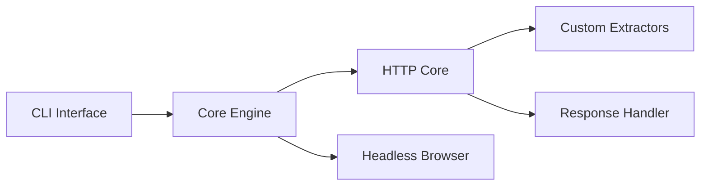

# projectdiscovery/httpx

> Boîte à outils en ligne de commande qui sonde des serveurs HTTP et en résume les réponses.

## Le problème
Vérifier à grande échelle quels hôtes répondent en HTTP, avec quel statut, quel titre, quelle technologie.

## Ce que ça fait vraiment
Le CLI lit hôtes, URL ou CIDR, envoie des requêtes en parallèle (50 threads, 150 requêtes/s par défaut) avec repli automatique de HTTPS vers HTTP. Il affiche statut, taille, titre, serveur, technologies, CDN, empreinte de favicon, TLS. Des filtres et matchers trient les résultats ; sorties JSON, CSV ou base de données. Utilisable aussi comme bibliothèque Go.

## Comment c'est branché


## Essayer
```bash
go install -v github.com/projectdiscovery/httpx/cmd/httpx@latest
httpx -h
echo target.com | httpx -path '/robots.txt' -mc 200
```

## Coût et pièges
Gratuit ; Go 1.25+ requis pour l'installation. Le projet annonce des changements cassants entre versions. Un tableau de bord cloud ProjectDiscovery est optionnel.

## Ce que ce n'est pas
Pas un scanner de vulnérabilités : il sonde et décrit. Le README déconseille de l'exécuter comme service (risques de sécurité). Sonder des tiers sans autorisation peut être illégal.

## Alternatives
Aucune alternative nommée dans le README.

## Pour toi
À surveiller : pratique pour vérifier la disponibilité de tes propres endpoints ou services d'inférence, sans être indispensable à un profil data/MLOps.

