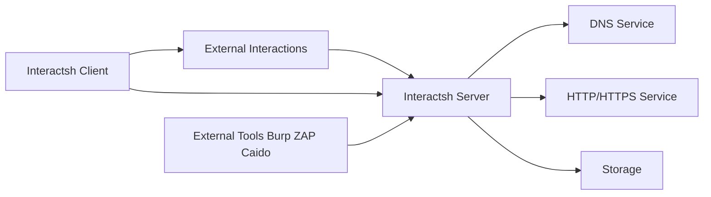

# projectdiscovery/interactsh

> Serveur et client pour détecter les interactions hors bande (DNS, HTTP, SMTP, LDAP) lors de tests de sécurité.

## Le problème
Certaines vulnérabilités (SSRF, injections aveugles) ne renvoient rien : il faut un point de rappel pour voir si la cible a émis une requête.

## Ce que ça fait vraiment
Le client génère des payloads uniques et interroge le serveur, qui écoute sur DNS, HTTP(S), SMTP(S), LDAP, et en option FTP, SMB, Responder. Les échanges sont chiffrés en AES, sans journalisation. Des extensions existent pour Burp, ZAP et Caido ; Nuclei l'utilise.

## Comment c'est branché


## Essayer
```bash
go install -v github.com/projectdiscovery/interactsh/cmd/interactsh-client@latest
interactsh-client
interactsh-client -v -o interactsh-logs.txt
docker run projectdiscovery/interactsh-client:latest
```

## Coût et pièges
Les serveurs publics (oast.pro…) peuvent changer ou tomber. Auto-hébergement : domaine, serveur 24h/24, ports ouverts. Certaines options exposent du code client sur ton domaine.

## Ce que ce n'est pas
Pas un scanner : il reçoit les rappels. À employer uniquement sur des cibles autorisées.

## Alternatives
- Nuclei : intègre Interactsh pour l'OAST automatisé.

## Pour toi
À ignorer : outil de test d'intrusion hors du périmètre data/IA, sauf audit de sécurité d'une plateforme.

