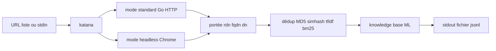

# projectdiscovery/katana

> Crawler web configurable, en mode standard ou navigateur sans interface, orienté automatisation.

## Le problème
Collecter les URL d'un site pour alimenter un corpus ou un audit demande de gérer portée, doublons et JavaScript.
Un crawler naïf explose en pages quasi identiques et rate tout ce qui est rendu côté client.

## Ce que ça fait vraiment
Deux modes : standard, via la bibliothèque HTTP Go, ou sans interface, en accrochant les appels dans le navigateur.
Parse le JavaScript pour en extraire des points d'entrée, et remplit automatiquement les formulaires (expérimental).
Filtre les pages similaires par simhash, TF-IDF ou BM25, avec budget par grappe, en plus du dédoublonnage MD5.
Sort en STDOUT, fichier ou JSONL, avec champs configurables et stockage des requêtes/réponses.

## Comment c'est branché


## Essayer
```bash
CGO_ENABLED=1 go install github.com/projectdiscovery/katana/cmd/katana@latest
katana -u https://tesla.com
echo https://tesla.com | katana
katana -u https://example.com -pcs -pcsm tfidf -pcst 0.85 -pcsn 2
```
En conteneur : `docker pull projectdiscovery/katana:latest` puis `docker run projectdiscovery/katana:latest -u https://tesla.com`.

## Coût et pièges
Go 1.26+ pour l'installation, et Chrome installé pour le mode sans interface avec `-system-chrome`.
Les options captcha (`-csp capsolver`, `-csk`) impliquent un service tiers payant et une clé à ta charge.

## Ce que ce n'est pas
Pas un outil sans conséquence : le bandeau du README rappelle que tu es responsable de ce que tu crawles.
Pas borné par défaut : sans `-d`, `-ct`, `-mdp` ou une portée, un crawl peut ne jamais finir.
Pas un extracteur de contenu : il découvre des URL et des points d'entrée, il ne construit pas ton corpus.

## Alternatives
`httpx` — cité en amont dans le pipeline (`cat domains | httpx | katana`) pour filtrer les hôtes vivants.

## Pour toi
Excellent collecteur d'URL en amont d'un RAG ou d'un crawl documentaire, à condition de toujours fixer une portée.
