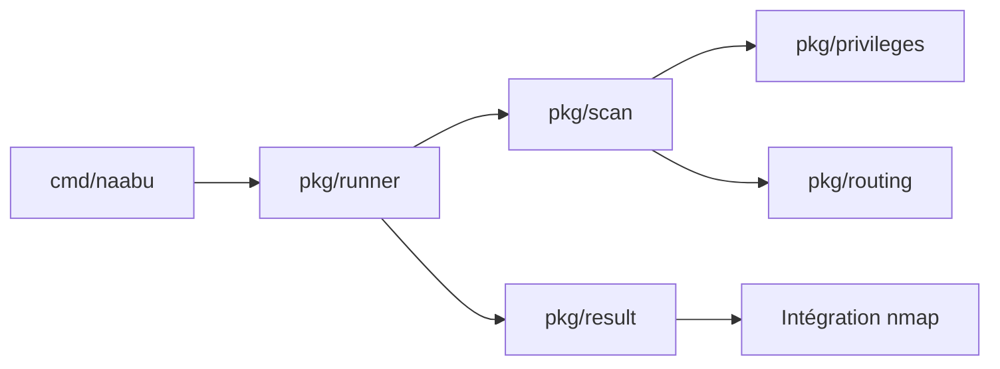

# projectdiscovery/naabu

> Scanner de ports en Go, en ligne de commande ou en bibliothèque, pour inventorier ses propres hôtes.

## Le problème
Savoir quels ports répondent sur un parc d'hôtes, de plages ou d'ASN demande un outil rapide, scriptable et chaînable avec d'autres.

## Ce que ça fait vraiment
Naabu énumère les ports ouverts par sondes SYN, CONNECT ou UDP, sur des entrées variées (hôte, liste, CIDR, ASN, stdin). Il gère IPv4/IPv6, la découverte d'hôtes (expérimentale), l'exclusion des CDN/WAF, la reprise de scan et un mode passif via Shodan InternetDB. La détection de version de service lit la base `nmap-service-probes` d'une installation nmap locale. Sortie en texte, JSON ou CSV, et une bibliothèque Go (`pkg/runner`) est fournie.

## Comment c'est branché


## Essayer
```bash
go install -v github.com/projectdiscovery/naabu/v2/cmd/naabu@latest
naabu -h
```
Prérequis du README : `libpcap` (Linux : `libpcap-dev`, Mac : brew, Windows : Npcap). Le README avertit que l'utilisateur est responsable de ses actions.

## Coût et pièges
Gratuit. Les scans SYN demandent les droits root, sinon repli sur CONNECT. Un débit élevé augmente les faux positifs. Le README suppose une exécution depuis un VPS ; l'option cloud ProjectDiscovery nécessite une clé d'API. Ne scanner que ce que l'on possède ou est autorisé à tester.

## Ce que ce n'est pas
Ce n'est pas un scanner de vulnérabilités : il liste des ports. La détection de service dépend d'une installation nmap locale, non livrée pour raison de licence. Plusieurs options sont marquées expérimentales ou dépréciées.

## Alternatives
- nmap : cité par le README, plus complet pour la détection de services, moins orienté volume.
- httpx : cité en aval pour identifier les serveurs HTTP sur les ports trouvés.

## Pour toi
Surveiller : utile ponctuellement pour l'inventaire d'exposition de ses propres services de données (bases, API de modèles), sans intérêt central pour un profil data/IA.

