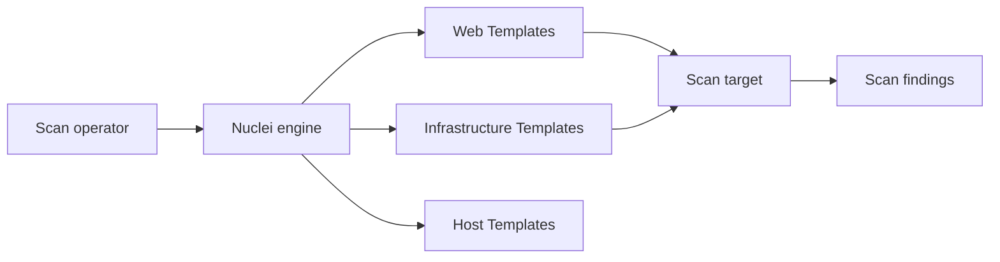

# projectdiscovery/nuclei-templates

> Bibliothèque communautaire de modèles de détection de vulnérabilités, lus par le moteur de scan Nuclei.

## Le problème
Vérifier qu'une application ou une infrastructure n'expose pas des failles connues suppose de décrire chaque contrôle sous une forme exécutable. Sans base partagée, chaque équipe réécrit les siens.

## Ce que ça fait vraiment
Ce dépôt ne contient pas de moteur : il stocke des modèles (environ 12 000 fichiers) consommés par le moteur Nuclei, distinct. Ils couvrent les protocoles HTTP, DNS, réseau, TLS, cloud, fichiers et code, plus des workflows. Le README annonce 1 496 modèles liés à des vulnérabilités connues comme exploitées (CISA KEV, VulnCheck KEV) et s'appuie sur des tags pour filtrer. Les contributions arrivent par pull request.

## Comment c'est branché


## Essayer
```bash
nuclei -tags kev,vkev
```
Seule commande présente dans le README ; l'installation du moteur relève de la documentation https://nuclei.projectdiscovery.io.

## Coût et pièges
Gratuit, licence MIT. Il faut le moteur Nuclei à part. Un scan ne doit viser que des systèmes dont on est propriétaire ou pour lesquels on a une autorisation écrite.

## Ce que ce n'est pas
Ce n'est pas un scanner autonome ni un outil de correction. Un modèle qui ne remonte rien ne prouve pas l'absence de faille. La qualité varie selon les contributeurs.

## Alternatives
Aucune alternative nommée dans le README.

## Pour toi
À surveiller : utile si ton périmètre MLOps inclut l'audit de services exposés (API de modèles, panneaux d'administration), sans intérêt direct pour un travail purement data.

