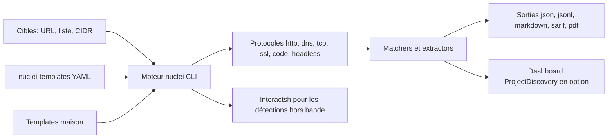

# projectdiscovery/nuclei

> **A command-line vulnerability scanner driven by YAML rules, for pentesters and security teams.**

## The problem

Without it, checking a fleet of domains or hosts for a known CVE means writing throwaway
scripts per flaw, or trusting a closed scanner whose rules you can neither read nor adapt.
The README states the case: fresh CVEs are mass-exploited within days, and a detection you
cannot edit yourself arrives too late.

## What it actually does

Nuclei reads YAML templates describing the request to send and what must appear in the
response to conclude, then runs them in parallel against one target, a list of targets or a
subnet. The README lists the supported protocols: TCP, DNS, HTTP, SSL, WHOIS, JavaScript,
`code`, headless, websocket and file. It clusters identical requests across templates
(`-dc` disables it), filters templates by tag, severity, author, id or protocol type, and
exports results as JSON, JSONL, Markdown, SARIF or PDF. The templates live in a separate
repository, `projectdiscovery/nuclei-templates`, fed by the community. The engine can sign
templates and refuse unsigned ones (`-sign`, `-dut`).

## How it is wired



The input is a target or list of targets; templates, either from the community library or
your own, describe the requests. The engine runs them over the requested protocol, matchers
decide whether there is a finding, and results go to a file or, only when asked, to the
hosted dashboard. Out-of-band detections go through Interactsh servers, hosted by default
but self-hostable (`-iserver`, `-itoken`).

## Trying it

```sh
go install -v github.com/projectdiscovery/nuclei/v3/cmd/nuclei@latest
nuclei -h
nuclei -target https://example.com
nuclei -list urls.txt
nuclei -target 192.168.1.0/24
nuclei -u https://example.com -t /path/to/your-template.yaml
nuclei -target example.com -json-export output.json
```

The README requires `go >= 1.24.2` for this install path and points to
`docs.projectdiscovery.io/tools/nuclei/install` for the other methods.

## Cost and traps

The binary is free and MIT-licensed, and the README says pushing results to the dashboard
(`-dashboard`) needs no subscription — but it does need a ProjectDiscovery API key
(`-auth`), hence an account. The Pro and Enterprise editions are paid. Two warnings come
from the README itself: the project is under active development with breaking changes on
releases, and it is built as a standalone CLI tool — "running nuclei as a service may pose
security risks". Defaults are aggressive at fleet scale: 150 requests per second, 25
templates in parallel; `-rl`, `-c` and `-bs` exist to slow it down. Finally `-lfa` lets
templates read any file on the machine, so do not combine it with templates of unknown
origin.

## What it is not

Not a dependency scanner nor a code analyzer: it tests what answers on the network, not a
manifest or an image. Not an exploitation framework: templates detect and verify, and the
README documents nothing beyond that. Not a turnkey product without its template library —
the engine alone detects nothing, and that library lives in another repository. The "zero
false positives" claim is README wording, not a measured guarantee. And it is not a service:
the README explicitly advises against exposing it as one.

## Alternatives

In the catalogue, `aquasecurity/trivy` and `anchore/grype` scan images and dependencies from
CVE databases — a neighbouring problem on a different surface: they look at what is
installed, nuclei looks at what answers. `future-architect/vuls` is closer for server
fleets but also starts from the package inventory. `google/syzkaller` is off-topic here
(kernel fuzzing). The README names no competitor, only the companion repository
`projectdiscovery/nuclei-templates`.

## For you

Worth it as soon as you have more than a handful of exposed services to watch: a scheduled
`nuclei -list`, or a CI step as the README suggests, gives a readable and editable safety
net. The real investment is learning the YAML template format to write your own checks; the
rest is rate tuning.
