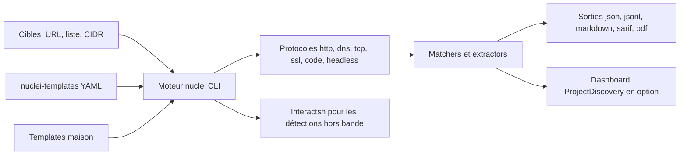

# projectdiscovery/nuclei

> **Scanner de vulnérabilités en ligne de commande piloté par des règles YAML, pour pentesters et équipes sécurité.**

## Le problème

Sans lui, vérifier qu'un parc de domaines ou de machines n'expose pas une CVE connue revient
à écrire des scripts jetables par faille, ou à faire confiance à un scanner fermé dont on ne
peut ni lire ni adapter les règles. Le README pose le constat : les CVE fraîches sont
exploitées en masse en quelques jours, et une détection qu'on ne peut pas modifier soi-même
arrive trop tard.

## Ce que ça fait vraiment

Nuclei lit des *templates* YAML qui décrivent la requête à envoyer et ce qu'il faut voir
dans la réponse pour conclure, puis les exécute en parallèle contre une cible, une liste de
cibles ou un sous-réseau. Il couvre plusieurs protocoles annoncés par le README : TCP, DNS,
HTTP, SSL, WHOIS, JavaScript, `code`, headless, websocket, fichier. Il regroupe les requêtes
identiques entre templates (clustering, désactivable par `-dc`), filtre les templates par
tags, sévérité, auteur, identifiant ou type de protocole, et exporte les résultats en JSON,
JSONL, Markdown, SARIF ou PDF. Les templates eux-mêmes vivent dans un dépôt séparé,
`projectdiscovery/nuclei-templates`, alimenté par la communauté. Le moteur peut aussi
signer et refuser les templates non signés (`-sign`, `-dut`).

## Comment c'est branché



L'entrée est une cible ou une liste de cibles ; les templates, ceux de la bibliothèque
communautaire ou les vôtres, décrivent les requêtes. Le moteur les exécute via le protocole
demandé, les *matchers* décident s'il y a vulnérabilité, et les résultats partent vers un
fichier ou, sur demande explicite, vers le tableau de bord hébergé. Les détections hors
bande passent par des serveurs Interactsh, hébergés par défaut mais auto-hébergeables
(`-iserver`, `-itoken`).

## Essayer

```sh
go install -v github.com/projectdiscovery/nuclei/v3/cmd/nuclei@latest
nuclei -h
nuclei -target https://example.com
nuclei -list urls.txt
nuclei -target 192.168.1.0/24
nuclei -u https://example.com -t /path/to/your-template.yaml
nuclei -target example.com -json-export output.json
```

Le README indique `go >= 1.24.2` pour cette installation et renvoie au guide
`docs.projectdiscovery.io/tools/nuclei/install` pour les autres méthodes.

## Coût et pièges

Le binaire est gratuit et MIT, et le README précise que l'envoi des résultats au tableau de
bord (`-dashboard`) ne demande aucun abonnement — mais il demande une clé d'API
ProjectDiscovery (`-auth`), donc un compte. Les éditions Pro et Enterprise, elles, sont
payantes. Deux avertissements viennent du README lui-même : le projet est en développement
actif avec des ruptures à chaque version, et il est pensé comme un outil CLI autonome —
« l'exécuter comme un service peut présenter des risques de sécurité ». Côté réseau, les
défauts sont agressifs à l'échelle d'un parc : 150 requêtes par seconde, 25 templates en
parallèle ; `-rl`, `-c` et `-bs` existent pour calmer le jeu. Enfin `-lfa` autorise les
templates à lire n'importe quel fichier de la machine : à ne pas combiner avec des templates
d'origine inconnue.

## Ce que ce n'est pas

Ce n'est pas un scanner de dépendances ni un analyseur de code : il teste ce qui répond sur
le réseau, pas un manifeste ou une image. Ce n'est pas un outil d'exploitation : les
templates détectent et vérifient, le README ne documente rien au-delà. Ce n'est pas non plus
un produit clé en main sans sa bibliothèque de templates — le moteur seul ne détecte rien,
et cette bibliothèque vit dans un autre dépôt. La promesse de « zéro faux positif » est une
formule du README, pas une garantie mesurée. Enfin, ce n'est pas un service : le README
déconseille explicitement de l'exposer comme tel.

## Alternatives

Dans le catalogue, `aquasecurity/trivy` et `anchore/grype` scannent des images et des
dépendances à partir de bases de CVE — problème voisin, surface différente :
eux regardent ce qui est installé, nuclei regarde ce qui répond. `future-architect/vuls`
est plus proche sur le parc de serveurs, mais part lui aussi de l'inventaire de paquets.
`google/syzkaller` est hors sujet ici (fuzzing de noyau). Le README ne cite aucun concurrent,
seulement le dépôt compagnon `projectdiscovery/nuclei-templates`.

## Pour toi

Utile dès qu'on a plus d'une poignée de services exposés à surveiller : un `nuclei -list`
en tâche planifiée, ou branché dans une CI comme le suggère le README, donne un filet de
sécurité lisible et modifiable. L'investissement réel est d'apprendre le format YAML des
templates pour écrire les vérifications maison ; le reste est du réglage de débit.
