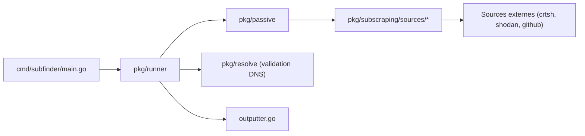

# projectdiscovery/subfinder

> Outil Go d'énumération passive de sous-domaines à partir de sources en ligne, pour testeurs d'intrusion.

## Le problème
Lister les sous-domaines d'un site sans interroger directement ses serveurs, en agrégeant plusieurs sources publiques.

## Ce que ça fait vraiment
Prend un ou plusieurs domaines, interroge des sources passives (crt.sh, Shodan, GitHub, VirusTotal, SecurityTrails…), normalise et déduplique, puis peut valider par DNS avec élimination des jokers. Options de débit global ou par source, filtres, sorties JSONL, entrée/sortie standard. Utilisable aussi comme bibliothèque Go.

## Comment c'est branché


## Essayer
```bash
go install -v github.com/projectdiscovery/subfinder/v2/cmd/subfinder@latest
subfinder -h
subfinder -d example.com
subfinder -dL domains.txt -oJ -o result.json
```

## Coût et pièges
Gratuit, mais de nombreuses sources exigent des clés d'API, à mettre dans le fichier de configuration des fournisseurs. Demande Go 1.26 pour l'installation. Les limites de débit des fournisseurs peuvent restreindre les résultats.

## Ce que ce n'est pas
Pas un scanner de vulnérabilités ni un outil de reconnaissance active complète : il ne fait qu'énumérer des sous-domaines.

## Alternatives
Le README ne nomme aucune alternative ; il renvoie à la documentation ProjectDiscovery.

## Pour toi
Ignorer : outil de reconnaissance en sécurité, hors profil data/IA/MLOps ; il ne servirait que pour inventorier tes propres domaines exposés.

