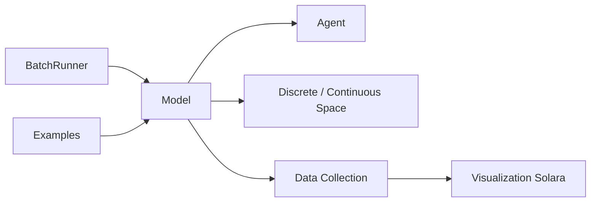

# projectmesa/mesa

> Bibliothèque Python de modélisation à base d'agents, avec visualisation navigateur et analyse de résultats.

## Le problème
Simuler des populations d'agents interagissant (épidémies, marchés, écosystèmes) sans repartir d'une base en NetLogo ou Java.

## Ce que ça fait vraiment
Composants modulaires : modèle, agents, ordonnancement, espaces (grilles discrètes, réseaux, espace continu expérimental), collecte de données et interface de visualisation dans le navigateur (Solara, Matplotlib). Les résultats sortent en structures pandas pour l'analyse. Une bibliothèque de modèles d'exemple (WolfSheep, Schelling, Sugarscape) sert de référence. Mesa 3 est stable, Mesa 4 est en pré-version.

## Comment c'est branché


## Essayer
```bash
pip install -U mesa
pip install -U "mesa[rec]"
docker compose up
```

## Coût et pièges
Gratuit. Depuis Mesa 3, les dépendances ne sont plus toutes installées par défaut : choisir des extras (`network`, `viz`, `rec`). Le diagramme mentionne un BatchRunner dont le placement exact n'est pas confirmé par le README.

## Ce que ce n'est pas
Pas un simulateur haute performance : positionné comme alternative Python à NetLogo, Repast et MASON. Modules expérimentaux instables.

## Alternatives
NetLogo, Repast, MASON (cités comme références visées).

## Pour toi
À adopter pour de la simulation multi-agents en Python : projet académique cité (JOSS), maintenu par la communauté, bien documenté.
