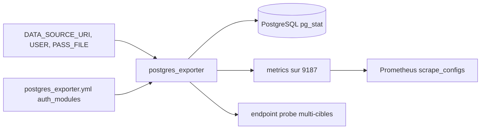

# prometheus-community/postgres_exporter

> Exportateur Prometheus qui expose les métriques d'un serveur PostgreSQL.

## Le problème
Les statistiques de PostgreSQL vivent dans des vues `pg_stat*` qu'aucun outil de supervision ne lit tout seul.
Sans traduction, pas d'alerte ni de graphique.

## Ce que ça fait vraiment
Expose les métriques sur `:9187/metrics`, prêtes à être collectées par Prometheus.
Une vingtaine de collecteurs activables ou désactivables : `locks`, `replication`, `stat_statements`, `wal`…
La connexion se décrit par `DATA_SOURCE_NAME` ou `DATA_SOURCE_URI` plus utilisateur et mot de passe,
avec des variantes `_FILE` pour lire un secret depuis un fichier plutôt qu'une variable d'environnement.
Versions PostgreSQL testées en intégration continue : 13 à 18.

## Comment c'est branché


## Essayer
```bash
docker run \
  --net=host \
  -e DATA_SOURCE_URI="localhost:5432/postgres?sslmode=disable" \
  -e DATA_SOURCE_USER=postgres \
  -e DATA_SOURCE_PASS=password \
  quay.io/prometheuscommunity/postgres-exporter
curl "http://localhost:9187/metrics"
```

## Coût et pièges
Gratuit. Le mot de passe en variable d'environnement est à éviter : préférer `DATA_SOURCE_PASS_FILE` monté.
Le processus du conteneur tourne en uid/gid 65534, ce qui compte pour les droits sur les fichiers montés.

## Ce que ce n'est pas
Pas un tableau de bord : il expose des métriques, Grafana ou autre les affiche.
Pas un superviseur applicatif — il lit les vues système, pas tes requêtes métier.
Plusieurs options historiques (`auto-discover-databases`, `extend.query-path`, `constantLabels`) sont dépréciées.

## Alternatives
`sql_exporter`, recommandé pour la supervision générique d'une base par requêtes SQL.

## Pour toi
Le standard si tu as un PostgreSQL à surveiller ; prévoir le rôle `pg_monitor` pour éviter le superutilisateur.
