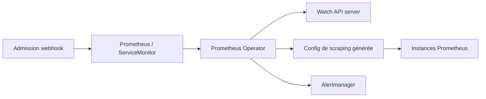

# prometheus-operator/prometheus-operator

> Déploiement et configuration de Prometheus et Alertmanager par ressources Kubernetes natives.

## Le problème
Configurer Prometheus dans Kubernetes veut dire écrire à la main un langage de configuration dédié,
et refaire ce travail à chaque changement de services ou de cibles.

## Ce que ça fait vraiment
Introduit des CRD — `Prometheus`, `PrometheusAgent`, `Alertmanager`, `ThanosRuler`, `ServiceMonitor`,
`PodMonitor`, `Probe`, `ScrapeConfig`, `PrometheusRule`, `AlertmanagerConfig` — et surveille l'API server
pour maintenir les déploiements en accord avec ces objets. Les cibles de scraping se déclarent par
sélecteurs de labels Kubernetes, sans écrire de configuration Prometheus. Un webhook d'admission valide
les `PrometheusRule` avant application, pour éviter qu'une règle invalide casse l'instance déployée.

## Comment c'est branché


## Essayer
```sh
kubectl create -f bundle.yaml
NAMESPACE=my_namespace kustomize edit set namespace $NAMESPACE && kubectl create -k .
make
scripts/run-external.sh <kubectl cluster name>
```

## Coût et pièges
Gratuit. Kubernetes 1.16 minimum. Le `bundle.yaml` déploie dans `default` : changer de namespace impose
d'adapter le ClusterRoleBinding. La désinstallation est manuelle et en plusieurs temps — supprimer les
ressources par namespace, puis l'opérateur, puis les services et les CRD.

## Ce que ce n'est pas
Pas une pile de supervision complète : le quickstart ne fournit que l'opérateur — kube-prometheus ou le
chart `kube-prometheus-stack` apportent exporters, tableaux de bord et règles d'alerte.
Les API `v1beta1` et `v1alpha1` sont instables, `v1alpha1` déconseillée hors environnements tolérants.

## Alternatives
- **kube-prometheus** : configurations d'exemple pour une pile de supervision complète.
- **prometheus-community/kube-prometheus-stack** : même périmètre via Helm, maintenu par la communauté.

## Pour toi
Le socle attendu dès qu'il faut mesurer des services de ML dans Kubernetes.
