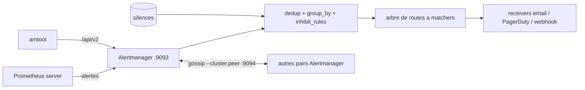

# prometheus/alertmanager

> **The alert router for Prometheus.** It deduplicates, groups, routes, silences, then notifies.

## The problem

Without it, a monitoring stack emits raw alerts: a hundred notifications for a single
incident, no way to batch them by cluster or service, no way to mute an alert during a
maintenance window, and no simple way to say "critical goes to the pager, the rest goes to
mail". The README names those four gaps directly: deduplicating, grouping, routing, and
silencing plus inhibition.

## What it actually does

Alertmanager receives alerts sent by client applications, chiefly the Prometheus server — it
does not produce them and evaluates no alerting rules. It deduplicates them, groups them by
labels (`group_by: ['alertname', 'cluster']`), delays them (`group_wait`, `group_interval`,
`repeat_interval`), then routes them down a tree of routes with matchers to *receivers*. It
also applies inhibition rules (mute `severity="warning"` when the same alert is already
`critical`) and hand-placed silences. Delivery goes through integrations: email, PagerDuty,
OpsGenie, or anything else via the webhook receiver. It exposes an API v2 generated with
OpenAPI and Go Swagger under `/api/v2`, a web UI on port 9093, and the `amtool` CLI bundled
with every release. High availability is enabled by default: instances gossip with each
other through the `--cluster.*` flags on port 9094.

## How it is wired



The README forbids load balancing traffic between Prometheus and its Alertmanagers: each
Prometheus lists **all** of them in `alerting.alertmanagers.static_configs`, because the
implementation expects every alert to reach every instance — the gossip cluster is what
deduplicates the notifications. The YAML config file carries `global`, the `route` tree,
`inhibit_rules` and `receivers`. The official architecture diagram lives at `doc/arch.svg`
in the repo and was not read here.

## Trying it

```bash
$ docker run --name alertmanager -d -p 127.0.0.1:9093:9093 quay.io/prometheus/alertmanager
# Alertmanager is then reachable at http://localhost:9093/

# from source (requires Go and Node.js with npm)
$ git clone https://github.com/prometheus/alertmanager.git
$ cd alertmanager
$ make build
$ ./alertmanager --config.file=<your_file>

# the CLI alone
$ go install github.com/prometheus/alertmanager/cmd/amtool@latest
$ amtool alert
$ amtool silence add alertname=Test_Alert
$ amtool config routes test --config.file=doc/examples/simple.yml --tree --verify.receivers=team-X-pager service=database owner=team-X

# a three-peer cluster locally (goreman + the repo's Procfile)
$ goreman start
```

The precompiled binaries from the *download* section on prometheus.io are the installation
path the README recommends.

## Cost and traps

The software is free and Apache 2.0; the cost sits elsewhere. The useful receivers —
PagerDuty, OpsGenie — are paid third-party services with their own `routing_key`, and email
assumes an SMTP host (`smtp_smarthost`). Documented traps: both UDP **and** TCP are required
for clustering since 0.15, so firewalls and containers must expose the clustering port for
both; `--cluster.advertise-address` is required when the host has no RFC 6890 address with a
default route; APIv1 was removed in 0.27.0, leaving only `/api/v2`; and an inhibition rule
whose `equal` labels are all missing from both source and target alerts **still applies**
(the README warns about this in capitals). Building from source needs Go and Node.js.

## What it is not

It is not a monitoring system: it scrapes nothing, evaluates no alerting rules and stores no
metrics — that all stays in Prometheus, which *sends* alerts to it. It is not an on-call
tool either: no team rotation, no escalation, no acknowledgement; it delegates those to
PagerDuty or OpsGenie. And its high availability is not a cluster behind a load balancer —
the README explicitly forbids that; the model is "everyone receives everything, gossip
deduplicates".

## Alternatives

- **prometheus/prometheus**: upstream, not a replacement — it evaluates the rules and pushes
  alerts here; you run both, not one or the other.
- **prometheus-operator/prometheus-operator**: preferable on Kubernetes, where it deploys and
  configures Alertmanager through CRDs instead of one hand-edited YAML file.
- **netdata/netdata**: for those wanting collection, dashboards and notifications in a single
  agent, at the cost of far coarser alert routing.

## For you

On a data/MLOps stack already instrumented with Prometheus there is little to deliberate:
this is the standard piece that turns a wall of training-job or pipeline alerts into one
notification per incident. The real work is not the install but the route tree and the
`inhibit_rules`, and `amtool config routes test` exists precisely to validate them before
production. Without Prometheus upstream, it is pointless.
