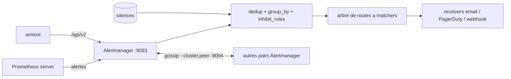

# prometheus/alertmanager

> **Le routeur d'alertes de Prometheus.** Il dédoublonne, groupe, route, met en silence, puis notifie.

## Le problème

Sans lui, chaque système de supervision envoie ses alertes brutes : cent notifications pour
un même incident, aucune façon de les regrouper par cluster ou par service, aucun moyen de
taire une alerte pendant une maintenance, et pas de façon simple de dire « cette alerte
critique part au pager, les autres par mail ». Le README décrit exactement ces quatre
manques : déduplication, groupement, routage, silences.

## Ce que ça fait vraiment

Alertmanager reçoit les alertes émises par des applications clientes, le serveur Prometheus
en premier lieu — il ne les produit pas lui-même, il ne fait aucune évaluation de règles.
Il les dédoublonne, les groupe selon des labels (`group_by: ['alertname', 'cluster']`), les
temporise (`group_wait`, `group_interval`, `repeat_interval`) puis les route dans un arbre de
routes à matchers vers des *receivers*. Il applique aussi des règles d'inhibition (taire les
alertes `severity="warning"` quand la même alerte est déjà `critical`) et des silences posés
à la main. La livraison passe par des intégrations : email, PagerDuty, OpsGenie, ou n'importe
quoi d'autre via le receiver webhook. Il expose une API v2 générée par OpenAPI / Go Swagger
sous le préfixe `/api/v2`, une interface web sur le port 9093, et un CLI `amtool` livré avec
chaque release. Le mode haute disponibilité est activé par défaut : les instances
communiquent en gossip via les drapeaux `--cluster.*` sur le port 9094.

## Comment c'est branché



Le README impose de ne pas répartir la charge entre Prometheus et ses Alertmanagers : chaque
Prometheus liste **tous** les Alertmanagers dans `alerting.alertmanagers.static_configs`, et
l'implémentation attend que toutes les alertes arrivent à toutes les instances — c'est le
cluster gossip qui déduplique les notifications. Le fichier de configuration YAML porte
`global`, l'arbre `route`, les `inhibit_rules` et les `receivers`. Le diagramme
d'architecture officiel est un fichier `doc/arch.svg` du dépôt, non lu ici.

## Essayer

```bash
$ docker run --name alertmanager -d -p 127.0.0.1:9093:9093 quay.io/prometheus/alertmanager
# Alertmanager est alors joignable sur http://localhost:9093/

# depuis les sources (requiert Go et Node.js avec npm)
$ git clone https://github.com/prometheus/alertmanager.git
$ cd alertmanager
$ make build
$ ./alertmanager --config.file=<your_file>

# le CLI seul
$ go install github.com/prometheus/alertmanager/cmd/amtool@latest
$ amtool alert
$ amtool silence add alertname=Test_Alert
$ amtool config routes test --config.file=doc/examples/simple.yml --tree --verify.receivers=team-X-pager service=database owner=team-X

# un cluster de trois pairs en local (goreman + Procfile du dépôt)
$ goreman start
```

Les binaires précompilés de la section *download* de prometheus.io sont la voie d'installation
recommandée par le README.

## Coût et pièges

Le logiciel est gratuit et sous Apache 2.0 ; le coût réel est ailleurs. Les receivers
utiles — PagerDuty, OpsGenie — sont des services tiers payants avec leur propre
`routing_key` ; l'email suppose un SMTP (`smtp_smarthost`). Pièges documentés : UDP **et**
TCP sont nécessaires au clustering depuis la 0.15, donc pare-feu et conteneurs doivent
exposer le port de cluster dans les deux protocoles ; `--cluster.advertise-address` devient
obligatoire si la machine n'a pas d'adresse RFC 6890 avec route par défaut ; l'APIv1 est
supprimée depuis la 0.27.0, seule `/api/v2` subsiste ; et une règle d'inhibition dont tous
les labels `equal` sont absents des deux côtés **s'applique quand même** (le README met en
garde en majuscules). Construire depuis les sources réclame Go et Node.js.

## Ce que ce n'est pas

Ce n'est pas un système de supervision : il ne scrute rien, n'évalue aucune règle d'alerte et
ne stocke pas de métriques — tout cela reste chez Prometheus, qui lui *envoie* les alertes.
Ce n'est pas non plus un outil d'astreinte : il n'a ni rotation d'équipes, ni escalade, ni
accusé de réception ; il délègue ça à PagerDuty ou OpsGenie. Enfin, sa haute disponibilité
n'est pas un cluster derrière un load balancer — le README l'interdit explicitement, le
modèle est « tout le monde reçoit tout, le gossip déduplique ».

## Alternatives

- **prometheus/prometheus** : l'amont, pas un remplaçant — c'est lui qui évalue les règles et
  pousse les alertes ici ; on prend les deux, pas l'un ou l'autre.
- **prometheus-operator/prometheus-operator** : à préférer sur Kubernetes, où il déploie et
  configure Alertmanager par CRD plutôt qu'à la main dans un YAML monolithique.
- **netdata/netdata** : pour qui veut collecte, visualisation et notifications dans un seul
  agent, au prix d'un routage d'alertes bien moins fin.

## Pour toi

Sur une stack data/MLOps déjà instrumentée Prometheus, c'est la brique standard et il n'y a
guère à délibérer : c'est elle qui transforme un mur d'alertes de jobs d'entraînement ou de
pipelines en une notification par incident. Le travail réel n'est pas l'installation mais
l'arbre de routes et les `inhibit_rules`, et `amtool config routes test` permet justement de
les valider avant de les mettre en production. Sans Prometheus en amont, l'intérêt est nul.
