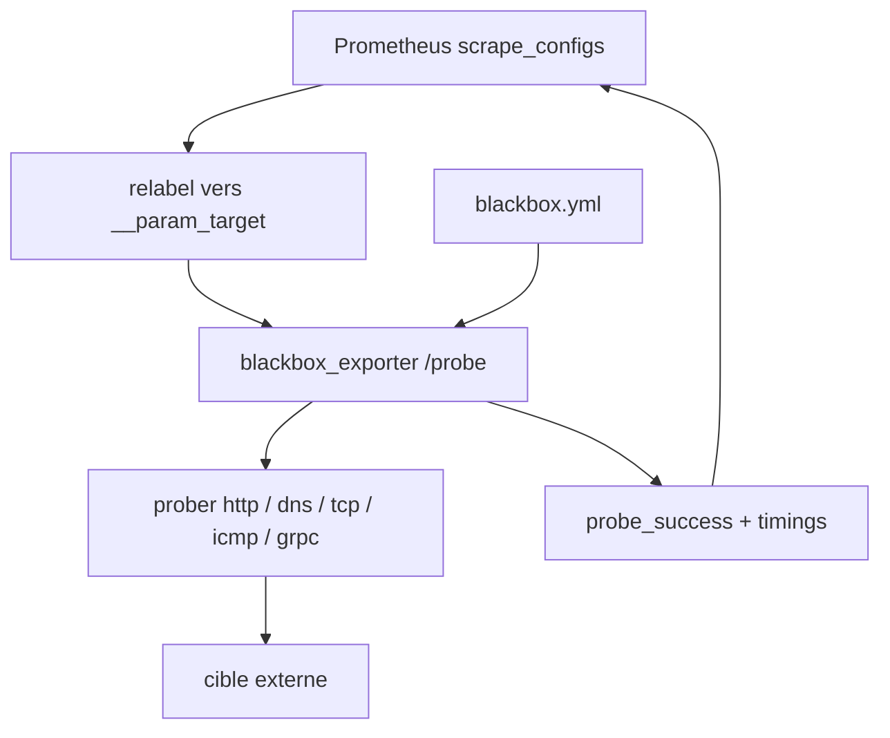

# prometheus/blackbox_exporter

> Sonde Prometheus qui teste des endpoints en HTTP, DNS, TCP, ICMP et gRPC.

## Le problème
Prometheus sait scraper ce qui expose des métriques ; il ne sait pas dire si un site répond, si un certificat tient ou si un DNS résout.
Sans sonde externe, la panne se constate côté utilisateur.

## Ce que ça fait vraiment
Un appel à `/probe?target=...&module=...` déclenche une sonde et renvoie les métriques du test, dont `probe_success` et les temporisations de chaque étape.
`debug=true` retourne le détail de la sonde ; le rapport `probe_duration_seconds / probe_timeout_seconds` dit combien de marge il reste avant le timeout.
Deux journaux structurés indépendants : `--log.level` pour l'application, `--log.prober` pour les sondes elles-mêmes, ce qui évite de noyer l'un dans l'autre.
La configuration se recharge par `SIGHUP`, par POST sur `/-/reload`, ou automatiquement avec `--config.enable-auto-reload` (intervalle réglable, 30 s par défaut).

## Comment c'est branché


## Essayer
```bash
docker run --rm \
-p 9115/tcp \
--name blackbox_exporter \
-v $(pwd):/config \
quay.io/prometheus/blackbox-exporter:latest --config.file=/config/blackbox.yml
curl -sL "http://localhost:9115/probe?target=prometheus.io&module=http_2xx&debug=true"
```

## Coût et pièges
Gratuit. La sonde ICMP demande des privilèges : Administrateur sous Windows, `CAP_NET_RAW` ou `net.ipv4.ping_group_range` sous Linux, root sous BSD.
Le timeout de sonde est déduit du `scrape_timeout` Prometheus ; sans rien, 120 s — et TLS/basic auth via `--web.config.file` s'appliquent à tous les endpoints, `/metrics` compris.

## Ce que ce n'est pas
Ce n'est pas un système d'alerte ni un dashboard : il produit des métriques, Prometheus fait le reste.
Ce n'est pas non plus multi-cible tout seul — le motif « multi-target exporter » impose du relabeling côté Prometheus, que le README renvoie vers un guide dédié.

## Alternatives
Aucune alternative n'est nommée dans le README.

## Pour toi
La brique standard pour surveiller de l'extérieur tes endpoints d'inférence ; rien à réinventer.
