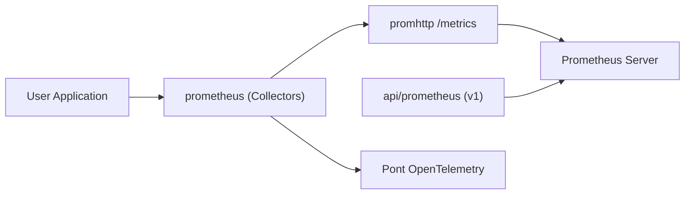

# prometheus/client_golang

> Bibliothèque Go officielle pour instrumenter des applications avec Prometheus et interroger son API HTTP.

## Le problème
Exposer des métriques d'une application Go dans un format que Prometheus sait scruter.

## Ce que ça fait vraiment
Deux parties : le paquet `prometheus` (compteurs, jauges, histogrammes, collecteurs Go et processus, `promhttp`) et un client de l'API HTTP Prometheus (`api/prometheus`), encore expérimental. Un pont OpenTelemetry permet d'exporter ces métriques en OTLP (push). Suit le versionnement sémantique ; l'API client en est exclue.

## Comment c'est branché

## Essayer
Aucune commande documentée : le README renvoie au guide d'instrumentation du site Prometheus et au dossier `examples/`.

## Coût et pièges
Gratuit. Supporte les deux dernières versions majeures de Go. Le client d'API peut casser sans changement de version majeure.

## Ce que ce n'est pas
Pas un serveur Prometheus ni un tableau de bord.

## Alternatives
Aucune nommée dans le README (pont OpenTelemetry cité).

## Pour toi
À surveiller : pertinent seulement pour des services Go à superviser ; en Python, prends le client Python de Prometheus.

