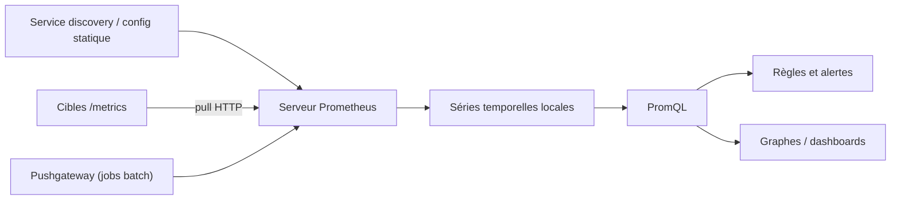

# prometheus/prometheus

> Système de supervision par métriques, projet de la Cloud Native Computing Foundation.

## Le problème
Sans collecte de métriques centralisée, un incident se diagnostique à l'aveugle et les seuils d'alerte n'existent pas.

## Ce que ça fait vraiment
Collecte des métriques sur des cibles à intervalle régulier en mode pull HTTP, évalue des expressions de règles, affiche les résultats et déclenche des alertes. Modèle de données multidimensionnel (nom de métrique + paires clé/valeur) interrogé en PromQL. Nœuds autonomes, sans dépendance à un stockage distribué. Les cibles viennent de la découverte de services ou d'une configuration statique ; les jobs batch poussent via une passerelle intermédiaire. Fédération hiérarchique et horizontale.

## Comment c'est branché


## Essayer
```bash
docker run --name prometheus -d -p 127.0.0.1:9090:9090 prom/prometheus
make build
./prometheus --config.file=your_config.yml
```

## Coût et pièges
Gratuit. Compiler demande Go (version du `go.mod`), NodeJS et npm ≥ 10. `go install` oblige à lancer depuis la racine du dépôt pour trouver les assets web, et n'inclut pas l'UI React sans `make assets`.

## Ce que ce n'est pas
`prometheus/prometheus` n'est **pas** conçu comme bibliothèque Go : des erreurs n'apparaissent qu'à cet usage. Les numéros de version Prometheus ne correspondent pas aux tags Go (v3.y.z ↔ v0.3yy.z). Le Remote Write protobuf publié sur buf.build est expérimental.

## Alternatives
- prometheus/common et prometheus/client-golang : les dépôts pensés, eux, comme bibliothèques réutilisables.

## Pour toi
À adopter : le standard de fait de la métrique côté MLOps, et la source des SLO d'un service de modèle.
