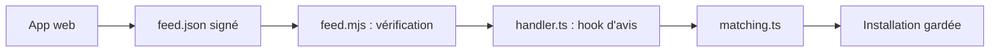

# prompt-security/clawsec

> Skills de sécurité et flux d'avis signés pour les runtimes d'agents OpenClaw, NanoClaw, Hermes et Picoclaw.

## Le problème
Installer des skills tiers dans un agent expose à des paquets vulnérables ou modifiés, sans vérification d'intégrité ni avis de sécurité.

## Ce que ça fait vraiment
`clawsec-suite` vérifie un flux d'avis signé (Ed25519), croise les avis avec les skills installés et bloque l'installation à risque jusqu'à une seconde confirmation explicite. D'autres paquets surveillent la dérive de fichiers sensibles, produisent des attestations et des audits. Un catalogue web présente skills, avis et wiki. Les dossiers `*-traffic-guardian` sont des spécifications, pas des proxys livrés.

## Comment c'est branché


## Essayer
```bash
npx skills add prompt-security/clawsec --skill clawsec-suite -a openclaw --global -y
node "$SUITE_DIR/scripts/setup_advisory_hook.mjs"
node "$SUITE_DIR/scripts/discover_skill_catalog.mjs"
```

## Coût et pièges
Gratuit. L'activation du hook modifie la configuration persistante d'OpenClaw (un aperçu s'affiche avant). Dépend d'un flux hébergé sur clawsec.prompt.security.

## Ce que ce n'est pas
Pas un antivirus : il recommande et filtre, les suppressions et dérogations restent soumises à approbation. Les protections varient selon la plateforme.

## Alternatives
Aucune alternative nommée dans le README.

## Pour toi
À surveiller : utile seulement si tu exploites des agents de la famille OpenClaw ; sinon peu d'intérêt, et la licence AGPL limite les réutilisations.

