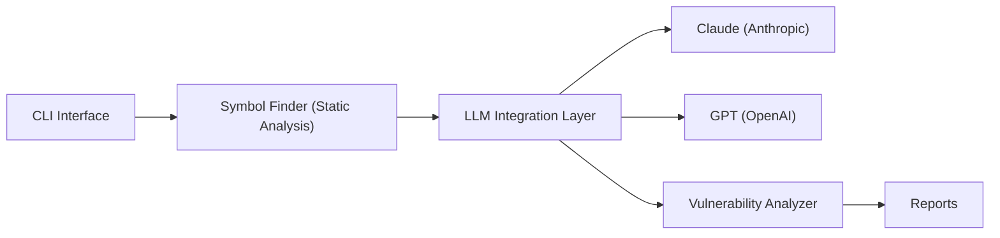

# protectai/vulnhuntr

> Outil qui cherche des failles exploitables à distance dans du code Python, en combinant LLM et analyse statique.

## Le problème
Les scanners classiques voient mal les vulnérabilités multi-étapes qui traversent plusieurs fichiers, de l'entrée utilisateur à la sortie serveur.

## Ce que ça fait vraiment
Le LLM résume le README, analyse un fichier, puis reçoit un prompt propre à chaque classe de faille (LFI, AFO, RCE, XSS, SQLI, SSRF, IDOR) et réclame les fonctions et classes nécessaires, résolues par Jedi. Il produit raisonnement, preuve de concept et score de confiance (7 à investiguer, 8+ probable). Python 3.10 uniquement.

## Comment c'est branché


## Essayer
```bash
pipx install git+https://github.com/protectai/vulnhuntr.git --python python3.10
export ANTHROPIC_API_KEY="sk-1234"
vulnhuntr -r /path/to/target/repo/
```

## Coût et pièges
Le README avertit qu'il peut faire grimper la facture : il remplit la fenêtre de contexte. Fixer des limites de dépense. Python 3.10 strictement requis. Dernier push en février 2025.

## Ce que ce n'est pas
Pas un scanner exhaustif : sept classes de failles, Python seulement. Ollama est marqué expérimental, les modèles ouverts structurent mal leur sortie.

## Alternatives
Aucune alternative nommée dans le README.

## Pour toi
À surveiller : utile pour auditer du code d'apps IA en Python, mais inactif depuis 2025 et coûteux en tokens ; tester sur un seul fichier d'abord.
