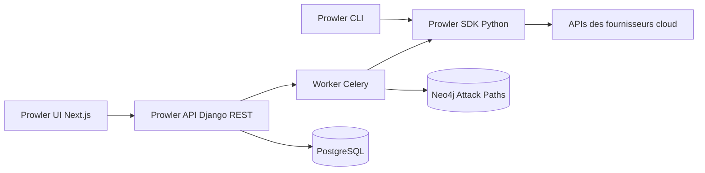

# prowler-cloud/prowler

> **Command-line multi-cloud compliance scanner, for security and platform teams.**

## The problem

Auditing an AWS, Azure or GCP account, or a Kubernetes cluster, by hand means re-reading
hundreds of settings against frameworks — CIS, PCI-DSS, ISO 27001 — that nobody knows by heart.
Without tooling the audit is one-off, manual and impossible to reproduce.

## What it actually does

Prowler runs a catalogue of Python checks against the APIs of some twenty providers: 662 AWS
checks over 86 services, 191 for Azure, 110 for GCP, 92 for Kubernetes, plus GitHub, M365, OCI,
Alibaba, Cloudflare, Okta, Vercel and more (figures from the README, "updated periodically").
Each finding maps to one or more compliance frameworks, and the README advertises an in-house
weighted score, ThreatScore, for prioritisation. Two shells around the same engine: the CLI
(`prowler <provider>`) and a self-hosted local server (Next.js UI + Django REST API + Celery
workers). On AWS an "Attack Paths" step joins the inventory produced by Cartography with the
findings in a Neo4j graph (or Neptune). For IaC and LLM coverage, Prowler simply calls out to
`trivy` and `promptfoo`.

## How it is wired



The Python SDK is the central piece: both the CLI and the worker call it, it queries the
provider APIs and returns findings. The local server adds the UI, the Django API, a Celery
worker and scheduler, PostgreSQL and Valkey; after each AWS scan the worker feeds the Neo4j
graph. The README also documents an MCP server exposing the Lighthouse assistant to the UI.

## Trying it

```console
pip install prowler
prowler -v
prowler <provider>
prowler <provider> --list-checks
prowler dashboard
```

For the local server, the README gives the Docker Compose path:

```console
VERSION=$(curl -s https://api.github.com/repos/prowler-cloud/prowler/releases/latest | jq -r .tag_name)
curl -sLO "https://raw.githubusercontent.com/prowler-cloud/prowler/refs/tags/${VERSION}/docker-compose.yml"
curl -sLO "https://raw.githubusercontent.com/prowler-cloud/prowler/refs/tags/${VERSION}/.env"
docker compose up -d
```

The interface then sits at http://localhost:3000, the API at http://localhost:8080/api/v1/docs.

## Cost and traps

The code is Apache 2.0 and the CLI is free. You need Python >=3.10 and <3.13 (a narrow window),
and Docker Compose for the local server. Scans consume the provider APIs: your credentials, and
where applicable your cloud bill. The README warns that default `.env` values are not suitable
for production and that the API generates a key pair that must never be reused or committed.
Attack Paths requires a long-lived Neo4j — or a paid Neptune cluster — and the caveat is
explicit: even in Neptune mode, Cartography ingestion goes through a temporary Neo4j, so the
`NEO4J_*` variables stay mandatory. Finally, the hosted Prowler Cloud offering is promoted
throughout, and both `--push-to-cloud` and the Lighthouse assistant point at that commercial
service.

## What it is not

It is not a remediation tool: Prowler detects and documents, it does not fix anything for you.
Nor is it its own IaC scanner or LLM red-teamer — on both fronts the README explicitly defers to
`trivy` and `promptfoo`. Five providers (Linode, Huawei, E2E, Scaleway, StackIT) are flagged
"Unofficial" and CLI-only. The README is saturated with marketing superlatives ("world's most
widely used", "AI Speed", "seamless") that must be set aside to judge the tool, and the check
counters are, by the authors' own admission, only refreshed periodically.

## Alternatives

- **aquasecurity/trivy** — the engine Prowler calls for IaC; prefer it if you only need manifest
  and image scanning, without the multi-cloud compliance layer.
- **bridgecrewio/checkov** — policy-as-code on Terraform/CloudFormation before deployment, where
  Prowler audits what is already running.
- **aquasecurity/kube-bench** — strictly the Kubernetes CIS Benchmark; lighter when the scope is
  a single cluster rather than a cloud estate.

## For you

If you operate cloud environments for data or ML workloads — buckets, IAM, K8s clusters, GitHub
orgs — this is the cheapest safety net to put in place: one `pip install` and a first scan
already give you a compliance map. Wire it into CI through the official GitHub Action rather
than running it by hand; leave the local server and Attack Paths for later, the infrastructure
they demand is not trivial.
