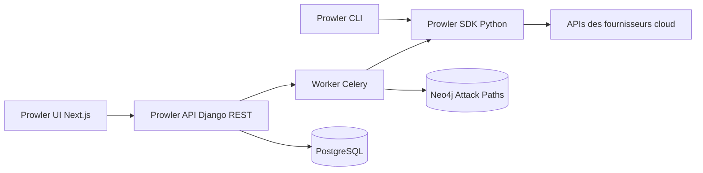

# prowler-cloud/prowler

> **Scanner de conformité multi-cloud en ligne de commande, pour équipes sécurité et plateforme.**

## Le problème

Auditer la configuration d'un compte AWS, Azure, GCP ou d'un cluster Kubernetes à la main
revient à relire des centaines de réglages face à des référentiels — CIS, PCI-DSS, ISO 27001 —
que personne ne connaît par cœur. Sans outil, l'audit est ponctuel, manuel et non reproductible.

## Ce que ça fait vraiment

Prowler exécute un catalogue de contrôles écrits en Python contre les API de vingt et quelques
fournisseurs : 662 contrôles AWS sur 86 services, 191 pour Azure, 110 pour GCP, 92 pour
Kubernetes, plus GitHub, M365, OCI, Alibaba, Cloudflare, Okta, Vercel et d'autres (chiffres du
README, « mis à jour périodiquement »). Chaque résultat est rattaché à un ou plusieurs
référentiels de conformité, et le README annonce un score pondéré maison, ThreatScore, pour
prioriser. Deux enveloppes autour du même moteur : la CLI (`prowler <provider>`) et un serveur
local auto-hébergé (UI Next.js + API Django REST + workers Celery). Sur AWS, une étape
« Attack Paths » croise l'inventaire produit par Cartography avec les résultats dans un graphe
Neo4j (ou Neptune). Pour l'IaC et les LLM, Prowler ne fait qu'appeler `trivy` et `promptfoo`.

## Comment c'est branché



Le SDK Python est la pièce centrale : CLI et worker l'appellent tous les deux, il interroge les
API des fournisseurs et rend les résultats. Le serveur local ajoute l'UI, l'API Django, un
worker et un ordonnanceur Celery, PostgreSQL et Valkey ; après chaque scan AWS le worker
alimente le graphe Neo4j. Le README documente aussi un serveur MCP qui expose l'assistant
Lighthouse à l'UI.

## Essayer

```console
pip install prowler
prowler -v
prowler <provider>
prowler <provider> --list-checks
prowler dashboard
```

Pour le serveur local, le README donne le chemin Docker Compose :

```console
VERSION=$(curl -s https://api.github.com/repos/prowler-cloud/prowler/releases/latest | jq -r .tag_name)
curl -sLO "https://raw.githubusercontent.com/prowler-cloud/prowler/refs/tags/${VERSION}/docker-compose.yml"
curl -sLO "https://raw.githubusercontent.com/prowler-cloud/prowler/refs/tags/${VERSION}/.env"
docker compose up -d
```

L'interface est alors sur http://localhost:3000, l'API sur http://localhost:8080/api/v1/docs.

## Coût et pièges

Le code est sous Apache 2.0, la CLI est gratuite. Il faut Python >=3.10 et <3.13 (fenêtre
étroite), et Docker Compose pour le serveur local. Les scans consomment les API des
fournisseurs : ce sont tes identifiants et, le cas échéant, ta facture cloud. Le README
prévient que les valeurs par défaut du `.env` ne conviennent pas en production et que l'API
génère une paire de clés à ne jamais réutiliser ni committer. Attack Paths impose un Neo4j
permanent — ou un cluster Neptune payant — et la clause est explicite : même en mode Neptune,
l'ingestion Cartography passe par un Neo4j temporaire, donc les variables `NEO4J_*` restent
obligatoires. Enfin, la version hébergée Prowler Cloud est mise en avant partout, et
`--push-to-cloud` comme l'assistant Lighthouse pointent vers ce service commercial.

## Ce que ce n'est pas

Ce n'est pas un outil de remédiation : Prowler détecte et documente, il ne corrige pas à ta
place. Ce n'est pas non plus un scanner IaC ni un red-teamer LLM propriétaire — sur ces deux
volets le README renvoie explicitement à `trivy` et `promptfoo`. Cinq fournisseurs (Linode,
Huawei, E2E, Scaleway, StackIT) sont marqués « Unofficial » et CLI seulement. Le README est
saturé de superlatifs marketing (« world's most widely used », « AI Speed », « seamless ») qu'il
faut savoir mettre de côté pour juger l'outil, et les compteurs de contrôles ne sont, de l'aveu
des auteurs, actualisés que périodiquement.

## Alternatives

- **aquasecurity/trivy** — c'est le moteur que Prowler appelle pour l'IaC ; à préférer si le
  besoin se limite au scan de manifestes et d'images, sans couche conformité multi-cloud.
- **bridgecrewio/checkov** — orienté policy-as-code sur le Terraform/CloudFormation avant
  déploiement, là où Prowler audite l'existant déjà en production.
- **aquasecurity/kube-bench** — strictement le CIS Benchmark Kubernetes ; plus léger si le
  périmètre est un seul cluster et non un parc cloud.

## Pour toi

Si tu opères des environnements cloud pour des charges data ou ML — buckets, IAM, clusters K8s,
comptes GitHub — c'est le filet de sécurité le moins cher à mettre en place : un `pip install`
et un premier scan donnent déjà une cartographie de conformité. À intégrer en CI via l'action
GitHub officielle plutôt qu'à lancer à la main ; garde en revanche le serveur local et Attack
Paths pour plus tard, l'infrastructure qu'ils demandent n'est pas anodine.
