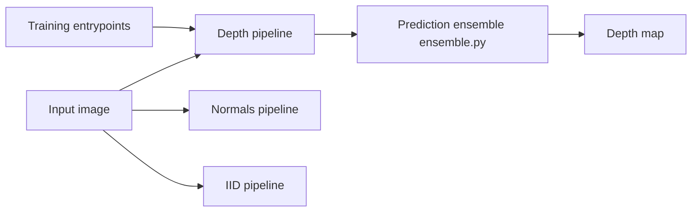

# prs-eth/Marigold

> Modèles de diffusion adaptés pour estimer profondeur, normales et décomposition intrinsèque d'une image, pour la vision par ordinateur.

## Le problème
Estimer la profondeur monoculaire ou les normales exige de gros jeux annotés ; la généralisation hors domaine est difficile.

## Ce que ça fait vraiment
Affine Stable Diffusion avec peu de données synthétiques pour produire cartes de profondeur, normales et composantes intrinsèques (apparence, éclairage), avec généralisation zéro-shot. Scripts d'inférence, d'évaluation et d'entraînement ; ensemble de prédictions et incertitude. Intégré aussi dans diffusers et accessible via démos Hugging Face.

## Comment c'est branché


## Essayer
```bash
git clone https://github.com/prs-eth/Marigold.git
cd Marigold
python -m venv venv/marigold
source venv/marigold/bin/activate
pip install -r requirements.txt
bash script/download_sample_data.sh
python script/depth/run.py --checkpoint prs-eth/marigold-depth-v1-1 --input_rgb_dir input/in-the-wild_example --output_dir output/in-the-wild_example --fp16
```

## Coût et pièges
Testé sur Ubuntu 22.04, CUDA 11.7, RTX 3090 ; le mode `--apple_silicon` existe. Les résultats peuvent différer légèrement d'un matériel à l'autre malgré la graine.

## Ce que ce n'est pas
Pas un modèle temps réel : c'est de la diffusion, avec plusieurs passes. L'entraînement exige de préparer Hypersim, Virtual KITTI 2, etc.

## Alternatives
Aucune alternative nommée dans le README.

## Pour toi
À adopter si tu fais de la vision 3D ou de la perception : référence académique (CVPR 2024), Apache 2.0, code complet de l'inférence à l'entraînement.

