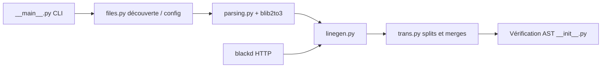

# psf/black

> Formateur de code Python sans compromis, qui supprime les débats de style, pour équipes Python.

## Le problème
Les revues de code s'enlisent dans des discussions de mise en forme, et chaque projet formate à sa manière.

## Ce que ça fait vraiment
Black réécrit des fichiers Python entiers avec un style unique et déterministe, en laissant peu d'options. Il lit sa configuration dans `pyproject.toml`, applique des règles d'inclusion et d'exclusion, met en cache les fichiers inchangés et formate en parallèle. Sauf avec `--fast`, il vérifie que le code reformaté a un AST équivalent à l'original. Il gère aussi les notebooks Jupyter, `blackd` (démon HTTP) et une GitHub Action.

## Comment c'est branché


## Essayer
```bash
pip install black
pip install "black[jupyter]"
black {source_file_or_directory}
python -m black {source_file_or_directory}
```

## Coût et pièges
Gratuit ; Python 3.10+ requis. `--fast` saute la vérification d'équivalence, plus lente sinon. Ce qui ressemble à un bug est parfois un comportement voulu, à vérifier dans la doc de style.

## Ce que ce n'est pas
Ni un linter ni un outil de refactoring : il ne formate que l'aspect visuel des fichiers. Il ne se configure presque pas, volontairement.

## Alternatives
- Aucune alternative nommée dans le README (pycodestyle n'y apparaît que comme source de remarques de style).

## Pour toi
Adopter : standard de fait du code Python data/IA, il uniformise les pull requests et les notebooks (`black[jupyter]`) sans effort de configuration.

