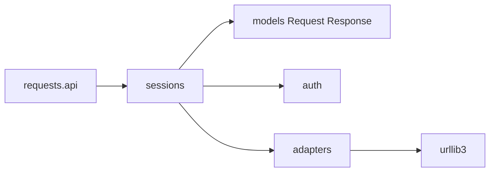

# psf/requests

> Bibliothèque HTTP Python pour envoyer des requêtes web avec très peu de code.

## Le problème
Appeler une API en HTTP avec la bibliothèque standard demande d'encoder soi-même paramètres, corps et authentification.

## Ce que ça fait vraiment
`requests` envoie des requêtes HTTP/1.1, gère l'authentification, les sessions et cookies, l'encodage de la réponse et le JSON (`r.json()`). Le README indique environ 300 millions de téléchargements par semaine et plus de 4 000 000 de dépôts dépendants. Le code s'appuie sur urllib3 pour le transport.

## Comment c'est branché


## Essayer
```python
import requests
r = requests.get('https://httpbin.org/basic-auth/user/pass', auth=('user', 'pass'))
r.status_code
r.json()
```
```bash
git clone -c fetch.fsck.badTimezone=ignore https://github.com/psf/requests.git
```

## Coût et pièges
Gratuit. Cloner le dépôt peut demander `-c fetch.fsck.badTimezone=ignore`. Le README n'explique pas l'installation par pip.

## Ce que ce n'est pas
Ce n'est pas un client asynchrone : le README ne mentionne que des appels synchrones.

## Alternatives
Aucune alternative nommée dans le README.

## Pour toi
Adopter : brique standard pour appeler des API de données et de modèles depuis Python.

