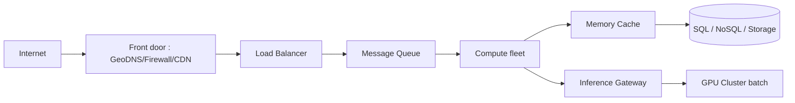

# pshenok/server-survival

> Jeu de simulation 3D où l'on joue un Cloud Architect construisant une infra résiliente.

## Le problème
Apprendre les concepts d'architecture cloud (autoscaling, circuit breaking, failover, batching d'inférence) reste abstrait sans les manipuler.

## Ce que ça fait vraiment
Chaque mécanique est un vrai concept cloud en miniature : observabilité, auto-scaling et cold start, scaling par profondeur de queue, circuit breaking, failover multi-région, serving d'inférence avec batching GPU, SLO d'inférence, puissance comme contrainte, OLTP vs OLAP. Modes Survival, Campaign (25 niveaux, dont un chapitre « The AI Wave » sur l'inférence GPU) et Sandbox (26 services). Export PNG et URL partageable de l'archi. Three.js, JavaScript vanilla, servi par GitHub Pages.

## Comment c'est branché


## Essayer
```bash
git clone https://github.com/pshenok/server-survival.git
cd server-survival
python3 -m http.server 8000
```

## Coût et pièges
Gratuit, jouable en ligne sans install. Pour tourner sa propre copie, servir le dossier (les modules ES sont bloqués en `file://`). Aucun compte.

## Ce que ce n'est pas
Pas un outil de production : un jeu pédagogique. Les valeurs (coûts, capacités) sont ludiques, pas des références réelles.

## Alternatives
- Datacenter Survival : jeu sœur (même auteur) sur la couche physique.

## Pour toi
Sympathique pour réviser les concepts d'archi cloud/inférence de façon ludique ; sans valeur opérationnelle directe — ignorer côté outillage.
