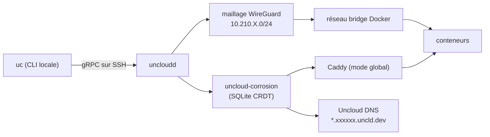

# psviderski/uncloud

> Orchestrateur de conteneurs sans plan de contrôle, pour déployer des applis web sur ses propres machines.

## Le problème
Déployer sur trois VPS loués chez trois hébergeurs oblige soit à payer une PaaS, soit à monter un
Kubernetes dont le plan de contrôle et le quorum sont à maintenir pour trois conteneurs.

## Ce que ça fait vraiment
Installe Docker et un démon `uncloudd` sur chaque machine via SSH, et monte un maillage WireGuard
avec un sous-réseau par machine (`10.210.X.0/24`). L'état du cluster est répliqué par `corrosion`,
une base SQLite distribuée en CRDT : chaque machine en a une copie complète, donc n'importe laquelle
sert de point d'entrée. Un Caddy en mode `global` sur chaque nœud surveille cet état et route le
trafic HTTPS. Les services sont décrits en Docker Compose, pas en DSL maison.

## Comment c'est branché


## Essayer
```bash
brew install psviderski/tap/uncloud
# ou : curl -fsS https://get.uncloud.run/install.sh | sh
uc machine init root@your-server-ip
uc run -p app.example.com:8000/https image/my-app
uc machine add --name hetzner-server root@5.223.45.199
uc ls
uc rm my-app-name
```

## Coût et pièges
Gratuit, mais il faut des serveurs à soi et un enregistrement DNS A à créer à la main. Le domaine
`*.cluster.uncloud.run` passe par le service DNS managé d'Uncloud, donc une dépendance externe.

## Ce que ce n'est pas
Pas un Kubernetes : pas de réconciliation d'état, l'approche est impérative et assumée comme telle.
Pas stable non plus — pré-1.0, avec des ruptures annoncées entre versions. Le rollback automatique
en cas d'échec de déploiement est annoncé comme « à venir », donc absent.

## Alternatives
- Kubernetes : si le quorum et les YAML complexes sont déjà en place et maîtrisés.
- Heroku / Render : cités par le README comme l'expérience à égaler, sans l'ops.
- Docker Compose seul : suffisant tant qu'on reste sur une machine.

## Pour toi
À regarder si tu héberges tes propres démos ou services de scoring ; trop jeune pour de la prod data.
