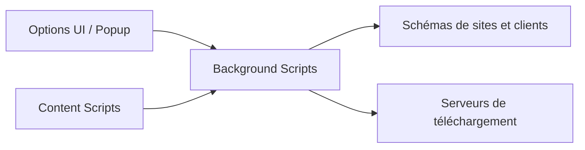

# pt-plugins/PT-Plugin-Plus

> Extension de navigateur pour sites de torrents privés : envoi en un clic vers un client de téléchargement.

## Le problème
Utiliser des trackers privés implique de copier des liens et de configurer chaque site et serveur de téléchargement.

## Ce que ça fait vraiment
Envoie des torrents vers Transmission, Synology Download Station, µTorrent, Deluge, qBittorrent, ruTorrent, Flood ; recherche agrégée multi-sites ; téléchargement par lots ; intégrations Douban et IMDb. Le README annonce l'arrêt de la maintenance et recommande PT-depiler.

## Comment c'est branché


## Essayer
```bash
# Aucune commande dans le README : installation décrite dans le Wiki
```

## Coût et pièges
Gratuit ; nécessite des comptes sur des trackers privés. Manifest V2 en fin de vie : l'extension peut être désactivée par Chrome.

## Ce que ce n'est pas
Un projet maintenu : archivé, avec un successeur nommé.

## Alternatives
PT-depiler, successeur recommandé par le README.

## Pour toi
Ignorer : archivé et sans rapport avec data/IA/MLOps.

