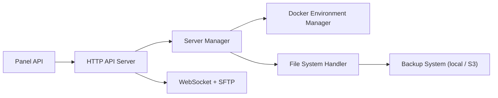

# pterodactyl/wings

> Démon de contrôle de serveurs de jeu de Pterodactyl, avec API HTTP et SFTP intégré.

## Le problème
Un panneau d'hébergement de serveurs de jeu a besoin d'un agent sur chaque machine pour piloter les conteneurs.

## Ce que ça fait vraiment
Expose une API HTTP pour agir sur les serveurs (cycle de vie, logs, sauvegardes), un WebSocket, un SFTP intégré avec les mêmes identifiants que le panel. D'après le schéma généré : pilote Docker, système de fichiers, sauvegardes locales ou S3, transferts, événements. Les issues se déposent sur le dépôt pterodactyl/panel.

## Comment c'est branché

## Essayer
Aucune commande dans le README ; installation via la documentation Wings (lien).

## Coût et pièges
Nécessite le panel Pterodactyl et Docker. Les sauvegardes S3 sont un service tiers. Aucun prérequis GPU ou API.

## Ce que ce n'est pas
Pas utilisable seul : c'est l'agent du panel Pterodactyl. Ce n'est pas un outil data ou IA.

## Alternatives
Le README ne cite aucune alternative.

## Pour toi
À ignorer : hébergement de serveurs de jeu, sans rapport avec un profil data/IA/MLOps.
