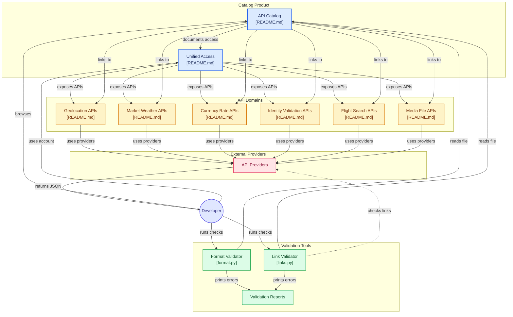

# public-apis/public-apis

> Catalogue communautaire d'APIs publiques classées par domaine, pour développeurs cherchant une source de données.

## Le problème
Trouver une API gratuite pour un domaine précis oblige à fouiller Google et à tester des services morts un par un.
On perd du temps sur l'authentification et le HTTPS avant même de savoir si l'API répond.

## Ce que ça fait vraiment
Un README géant, un index de ~50 catégories (Animals, Machine Learning, Finance, Anti-Malware, Blockchain…).
Chaque entrée est une ligne de tableau : nom, description, type d'auth (`No`, `apiKey`, `OAuth`), HTTPS, CORS.
Une section MCP Servers récente liste des serveurs Model Context Protocol avec transport (`stdio`, `HTTP`) et cible d'installation.
Deux scripts de validation (`format.py`, `links.py`) vérifient la forme du README et les liens morts.

## Comment c'est branché


## Essayer
```bash
# Aucune commande d'installation ou d'usage n'est documentée dans le README :
# le dépôt se consulte, il ne s'exécute pas.
# Les seuls exécutables cités sont les validateurs, sans ligne de commande fournie :
# scripts/validate/format.py et scripts/validate/links.py
```

## Coût et pièges
Le catalogue est gratuit, mais une bonne moitié des entrées exigent une `apiKey` ou un `OAuth`, donc un compte chez le fournisseur.
Le README est ouvert par un bloc promotionnel APILayer (le sponsor) : les premières APIs listées ne sont pas les plus neutres du lot.

## Ce que ce n'est pas
Ce n'est pas un proxy ni un SDK : rien n'est appelé pour toi, tu récupères juste une URL et un mode d'auth.
Ce n'est pas un annuaire vérifié en continu — la colonne CORS est souvent `Unknown`, et la fraîcheur d'une entrée dépend du dernier contributeur.
Ce n'est pas non plus un catalogue MCP sérieux : la section ne compte que quelques lignes.

## Alternatives
APILayer : si tu veux une clé unique et une facturation unique plutôt que trente comptes — mais c'est un SaaS payant.
Aucun autre dépôt concurrent n'est nommé dans le README.

## Pour toi
Utile comme signet quand tu cherches un jeu de données public pour un POC ; à ne pas confondre avec une source de données fiable en production.
