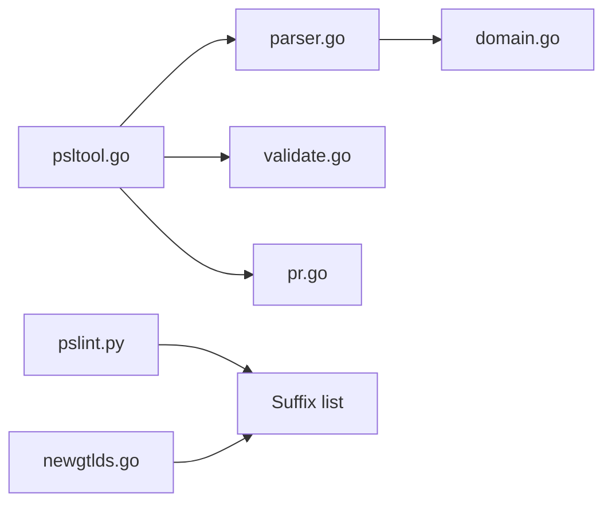

# publicsuffix/list

> La liste de référence des suffixes sous lesquels on peut enregistrer des noms de domaine, pour développeurs web et navigateurs.

## Le problème
Sans liste commune, impossible de savoir si `co.uk` ou `pvt.k12.ma.us` est un domaine enregistrable : cookies et frontières de sites deviennent faux.

## Ce que ça fait vraiment
Le dépôt contient la liste elle-même, maintenue par des bénévoles, et l'outillage pour la modifier : une CLI `psltool` (Go) qui analyse, formate et valide la liste, un linter de syntaxe `pslint.py`, un générateur de la liste des gTLD (`newgtlds.go`) et un vérificateur de domaines privés. Les contributions passent par des PR qui doivent suivre un gabarit imposé.

## Comment c'est branché


## Essayer
```bash
# Aucune commande d'installation dans le README :
# consulter https://publicsuffix.org/ et le wiki.
```

## Coût et pièges
Gratuit. Les ajouts exigent un gabarit de PR strict, sinon la PR est fermée sans suite ; aucun support n'est offert aux demandeurs.

## Ce que ce n'est pas
Pas un service d'assistance : le README le dit explicitement. Pas un contournement des limites de sous-domaines de Cloudflare ou d'AdSense. Une entrée mal formée peut casser les cookies d'un site.

## Alternatives
Aucune alternative nommée dans le README.

## Pour toi
À surveiller : tu consommes cette liste indirectement via tes bibliothèques d'URL, mais tu n'as aucune raison de l'intégrer toi-même, sauf pour y inscrire un domaine.

