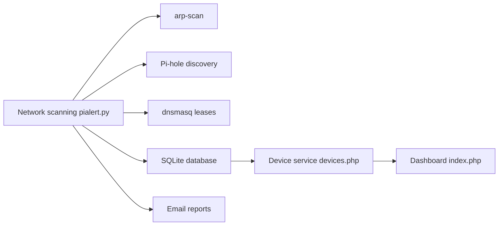

# pucherot/Pi.Alert

> Détecteur d'appareils inconnus sur un réseau Wi-Fi ou LAN, pour particuliers et petits réseaux.

## Le problème
On ne sait pas quels appareils se connectent à son réseau domestique ou de laboratoire, ni quand un appareil censé être toujours allumé disparaît.

## Ce que ça fait vraiment
Une partie « back » en Python scanne régulièrement le réseau, stocke les résultats dans SQLite et envoie des rapports par e-mail. Elle détecte nouveaux appareils, reconnexions, déconnexions, appareils « toujours connectés » absents, changements d'IP locale et d'IP Internet. Une partie « front » en PHP affiche inventaire, sessions, événements et présence. Trois méthodes de scan : arp-scan, puis, en option, Pi-hole et les baux dnsmasq.

## Comment c'est branché


## Essayer
```bash
curl -sSL https://github.com/pucherot/Pi.Alert/raw/main/install/pialert_install.sh | bash
curl -sSL https://github.com/pucherot/Pi.Alert/raw/main/install/pialert_update.sh | bash
```

## Coût et pièges
Gratuit. Conçu pour Raspberry Pi, « probablement » compatible avec d'autres distributions Linux. L'installation passe par un script téléchargé et exécuté directement : à relire avant de lancer. Dernier push en février 2024, 124 issues ouvertes.

## Ce que ce n'est pas
Pas un IDS ni un pare-feu : il signale des appareils, il ne bloque rien. Il ne voit que ce que arp-scan, Pi-hole ou dnsmasq exposent. L'auteur signale lui-même un niveau limité en Python, PHP et JavaScript.

## Alternatives
Aucune citée dans le README, hors les composants Pi-hole et dnsmasq qu'il utilise comme sources.

## Pour toi
Surveiller : utile pour un homelab, mais le dépôt n'est plus mis à jour depuis plus d'un an et n'a pas de lien direct avec le travail data/IA/MLOps.

