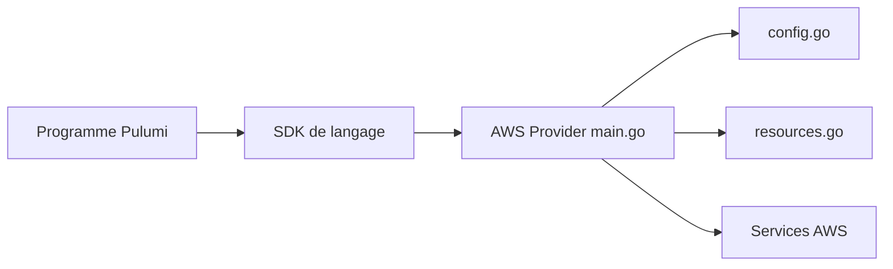

# pulumi/pulumi-aws

> Fournisseur Pulumi pour décrire et gérer des ressources AWS en TypeScript, Python, Go, .NET ou Java.

## Le problème
Déclarer l'infrastructure AWS en console ou en YAML est peu typé et difficile à factoriser.

## Ce que ça fait vraiment
Expose toutes les ressources AWS (EC2, ECS, IAM, Lambda, API Gateway…) en SDK typés générés, avec des API de confort comme `aws.lambda.CallbackFunction`. Configuration par région, profil, rôle assumé, endpoints personnalisés. Le provider est un binaire Go qui s'appuie sur le provider upstream.

## Comment c'est branché


## Essayer
```bash
npm install @pulumi/aws
pip install pulumi_aws
go get github.com/pulumi/pulumi-aws/sdk/v7
dotnet add package Pulumi.Aws
```

## Coût et pièges
Il faut le CLI Pulumi et des identifiants AWS ; les ressources créées sont facturées par AWS. 391 issues ouvertes.

## Ce que ce n'est pas
Pas un outil autonome : sans CLI Pulumi ni compte AWS, rien ne tourne. Le README est une référence de configuration, pas un tutoriel.

## Alternatives
Aucune alternative citée dans le README.

## Pour toi
À surveiller : pertinent si tu provisionnes l'infra MLOps sur AWS en code ; sinon inutile.

