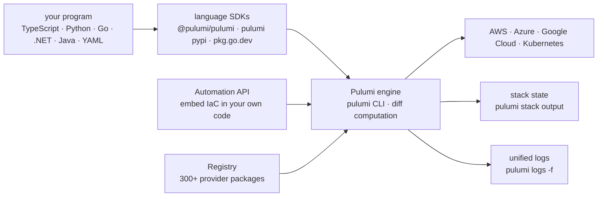

# pulumi/pulumi

> **Describe cloud infrastructure in TypeScript, Python, Go or Java instead of YAML.**

## The problem

Describing cloud infrastructure usually means declarative configuration files where any loop,
condition or factoring turns into template contortion. You write the same server block three
times over, with no typing, no functions, no package manager, and no way to test any of it with
the tooling of the language you use the rest of the day.

## What it actually does

Pulumi takes a program written in a general-purpose language, derives the set of cloud resources
it implies, and computes the minimal diff against existing state on each `pulumi up`. The repo
holds three things, as the README states: the `pulumi` CLI, the core engine, and the language
SDKs — the resource libraries themselves live in separate repos.

Languages listed as stable: JavaScript, TypeScript, Python, Go, .NET (C#/F#/VB.NET), Java and
YAML. Targets listed: AWS, Azure, Google Cloud, Kubernetes and "300+ providers" from an online
registry. `pulumi new` scaffolds a project from a template catalogue; `pulumi stack output`,
`pulumi logs -f` and `pulumi destroy` cover outputs, unified logs and teardown.

Two structural points from the README: the Automation API, which lets you drive the engine from
your own code rather than the command line, and the fact that the TypeScript examples inline an
*anonymous* JavaScript function as the body of a scheduled Lambda (`aws.cloudwatch.onSchedule`)
— application code defined inside the infrastructure program itself.

## How it is wired

No code-derived diagram exists for this repo; the graph below is reconstructed from the README
alone, from the components it names.



Resource packages (`@pulumi/aws` and the rest) are not in this repo: the README says individual
libraries each live in their own.

## Trying it

Commands copied from the README, in the order it gives them:

```bash
curl -fsSL https://get.pulumi.com/ | sh

mkdir pulumi-demo && cd pulumi-demo
pulumi new serverless-aws-typescript

pulumi up

curl $(pulumi stack output url)

pulumi logs -f

pulumi destroy -y
```

## Cost and gotchas

- **A cloud account is the real prerequisite.** The README's getting-started path deploys real
  AWS resources (Lambda, DynamoDB, EC2): credentials are required, and `pulumi up` bills at the
  provider, not at Pulumi.
- **Install runs a remote script**: `curl -fsSL https://get.pulumi.com/ | sh` executes a
  downloaded shell script. The README points to further installation options for those who would
  rather not.
- **Language runtime is on you**: Node.js (Current/Active/Maintenance LTS), Python, Go, .NET or
  JDK 11+ depending on the SDK. The README's `serverless-aws-typescript` template assumes Node.
- **Registry and products are hosted services**: the package registry, the docs and secrets
  management (Pulumi ESC) are the vendor's online services. The README documents no pricing —
  check it before relying on anything beyond the CLI.
- **`pulumi destroy -y` removes everything** the program created, with no confirmation prompt.

## What it is not

- **Not a cloud provider, and not a resource library.** This repo is the engine, the CLI and the
  SDKs; `@pulumi/aws` and the 300+ other packages live elsewhere. Cloning this one gives you no
  AWS or Kubernetes resources.
- **Writing code does not spare you knowing the target cloud.** The README examples handle
  `SecurityGroup`, AMIs and DynamoDB tables: the mental model stays the provider's, only the
  syntax changes.
- **Not a security auditor or a cost-control tool**: nothing in the README scans configurations
  for misconfiguration or estimates the bill before deployment.

## Alternatives

| | When to prefer it |
|---|---|
| **pulumi/pulumi-aws** | Not a competitor but the required companion for AWS: the resource package the README examples import as `@pulumi/aws`. You take both, never one instead of the other. |
| **infracost/infracost** | Catalogue neighbour, orthogonal: estimates the cost of infrastructure-as-code before deploying it. Sits *beside* Pulumi, not in place of it — Pulumi deploys, it does not price. |
| **aquasecurity/trivy** and **prowler-cloud/prowler** | Catalogue neighbours that are not comparable: security and compliance scanners, not provisioning engines. |

## For you

Adopt it as soon as a data or training platform has to be reproducible: describing a GPU cluster,
a bucket, a database or an inference service in the same Python as the rest of the project closes
the gap between code and substrate, and the Automation API lets a pipeline provision instead of a
human. Skip it if your infrastructure is three resources set up once: the engine, the stack state
and the discipline they impose cost more than the problem does.
