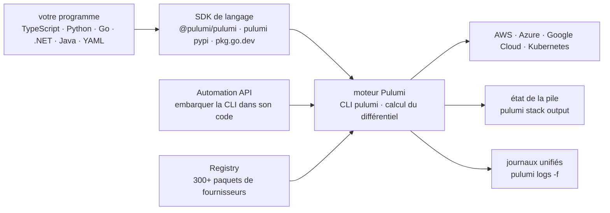

# pulumi/pulumi

> **Décrire son infrastructure cloud en TypeScript, Python, Go ou Java plutôt qu'en YAML.**

## Le problème

Décrire une infrastructure cloud passe d'ordinaire par des fichiers de configuration déclaratifs
où la moindre boucle, condition ou factorisation devient un contorsionnement de gabarit. On
réécrit trois fois le même bloc de serveur, sans typage, sans fonctions, sans gestionnaire de
paquets, et sans pouvoir tester quoi que ce soit avec les outils du langage qu'on utilise le
reste de la journée.

## Ce que ça fait vraiment

Pulumi prend un programme écrit dans un langage généraliste et en déduit l'ensemble des
ressources cloud à créer, puis calcule le différentiel minimal avec l'état existant à chaque
`pulumi up`. Le dépôt contient trois choses, le README le dit explicitement : la CLI `pulumi`,
le moteur central, et les SDK de langage — les bibliothèques de ressources, elles, vivent dans
des dépôts séparés.

Les langages annoncés stables sont JavaScript, TypeScript, Python, Go, .NET (C#/F#/VB.NET),
Java et YAML. Les cibles annoncées sont AWS, Azure, Google Cloud, Kubernetes et « 300+
fournisseurs » listés dans un registre en ligne. Une commande `pulumi new` amorce un projet
depuis un catalogue de gabarits ; `pulumi stack output`, `pulumi logs -f` et `pulumi destroy`
couvrent la lecture des sorties, les journaux unifiés et la suppression.

Deux points structurants du README : l'Automation API, qui permet d'appeler le moteur depuis
son propre code au lieu de la ligne de commande, et la capacité des exemples TypeScript à
inscrire une fonction JavaScript *anonyme* directement comme corps d'une Lambda planifiée
(`aws.cloudwatch.onSchedule`), c'est-à-dire du code applicatif défini dans le programme
d'infrastructure lui-même.

## Comment c'est branché

Aucun diagramme tiré du code n'existe pour ce dépôt : le schéma ci-dessous est reconstruit
depuis le seul README, à partir des composants qu'il nomme.



Les paquets de ressources (`@pulumi/aws` et les autres) ne sont pas dans ce dépôt : le README
précise que les bibliothèques individuelles ont chacune le leur.

## Essayer

Commandes copiées du README, dans l'ordre où il les donne :

```bash
curl -fsSL https://get.pulumi.com/ | sh

mkdir pulumi-demo && cd pulumi-demo
pulumi new serverless-aws-typescript

pulumi up

curl $(pulumi stack output url)

pulumi logs -f

pulumi destroy -y
```

## Coût et pièges

- **Un compte cloud est le vrai prérequis.** Le parcours de démarrage du README déploie de
  vraies ressources AWS (Lambda, DynamoDB, EC2) : il faut des identifiants, et `pulumi up`
  facture chez le fournisseur, pas chez Pulumi.
- **Installation par script distant** : `curl -fsSL https://get.pulumi.com/ | sh` exécute un
  script téléchargé. Le README renvoie vers des « installation options » supplémentaires pour
  qui ne veut pas de ce chemin.
- **Runtime du langage à sa charge** : Node.js (versions Current/Active/Maintenance LTS), Python,
  Go, .NET ou JDK 11+ selon le SDK choisi. Le gabarit `serverless-aws-typescript` du README
  suppose Node.
- **Le registre et les produits sont hébergés** : le registre de paquets, la documentation et la
  gestion de secrets (Pulumi ESC) sont des services en ligne de l'éditeur. Le README ne
  documente aucune grille tarifaire — à vérifier avant de s'appuyer sur autre chose que la CLI.
- **`pulumi destroy -y` supprime tout** ce que le programme a créé, sans confirmation avec `-y`.

## Ce que ce n'est pas

- **Ce n'est pas un fournisseur de cloud ni une bibliothèque de ressources.** Ce dépôt est le
  moteur, la CLI et les SDK ; `@pulumi/aws` et les 300+ autres paquets sont ailleurs. Cloner
  celui-ci ne donne aucune ressource AWS ou Kubernetes.
- **Écrire du code ne dispense pas de connaître le cloud visé.** Les exemples du README
  manipulent des `SecurityGroup`, des AMI, des tables DynamoDB : le modèle mental reste celui du
  fournisseur, seule la syntaxe change.
- **Ce n'est pas un outil d'audit ni de maîtrise des coûts** : rien dans le README ne scanne les
  configurations pour des failles ni n'estime la facture avant déploiement.

## Alternatives

| | Quand le préférer |
|---|---|
| **pulumi/pulumi-aws** | Ce n'est pas un concurrent mais le complément indispensable pour la cible AWS : le paquet de ressources que les exemples du README importent sous `@pulumi/aws`. On prend les deux, jamais l'un à la place de l'autre. |
| **infracost/infracost** | Voisin de catalogue, orthogonal : estime le coût d'une infrastructure décrite en code avant de la déployer. À poser *à côté* de Pulumi, pas en remplacement — Pulumi déploie, il ne chiffre pas. |
| **aquasecurity/trivy** et **prowler-cloud/prowler** | Voisins de catalogue non comparables : ce sont des scanners de sécurité et de conformité, pas des moteurs de provisionnement. |

## Pour toi

À adopter dès qu'une plateforme de données ou d'entraînement doit être reproductible : décrire
un cluster GPU, un bucket, une base ou un service d'inférence dans le même Python que le reste
du projet évite le fossé entre le code et son socle, et l'Automation API permet de provisionner
depuis un pipeline plutôt qu'à la main. À laisser de côté si l'infrastructure tient en trois
ressources posées une fois pour toutes : le moteur, l'état des piles et la discipline qu'ils
imposent coûtent plus cher que le problème.
