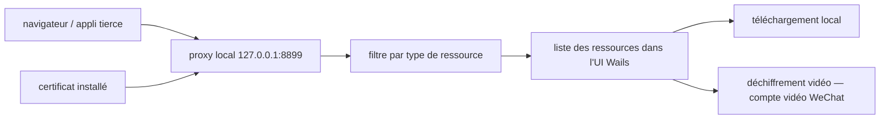

# putyy/res-downloader

> **Une phrase.** Application de bureau Go + Wails qui intercepte le trafic via un proxy local pour repérer et télécharger vidéos, audio, images et m3u8.

## Le problème

Récupérer un média affiché dans une application fermée (mini-programme, compte vidéo WeChat, appli mobile) suppose normalement de monter un proxy d'interception type Fiddler ou Charles, d'installer un certificat, puis de lire soi-même les requêtes. Le README pose explicitement ce constat : même principe, mais barrière d'usage trop haute pour un public non technique.

## Ce que ça fait vraiment

Le logiciel lance un proxy local (adresse `127.0.0.1`, port `8899` d'après la FAQ) et filtre le trafic qui le traverse pour en extraire des ressources. Les types annoncés sont vidéo, audio, image, m3u8 et flux direct. Les plateformes citées sont le compte vidéo WeChat, les mini-programmes, Douyin, Kuaishou, Xiaohongshu, Kugou Music et QQ Music. L'interface liste les ressources détectées au fur et à mesure de la navigation faite à l'extérieur du logiciel. Une opération `视频解密（视频号）` — déchiffrement vidéo pour le compte vidéo WeChat — est disponible sur les entrées de la liste. Le README mentionne aussi un réglage de proxy sortant pour atteindre des ressources en réseau restreint.

## Comment c'est branché



Aucun diagramme tiré du code n'est disponible pour ce dépôt : le schéma ci-dessus est reconstruit depuis le README seul, qui ne nomme aucun fichier source.

## Essayer

Aucune commande de build ou d'installation n'est documentée dans le README : la distribution passe par des binaires de la page Releases GitHub (ou un miroir Lanzou, mot de passe `9vs5`). La procédure décrite est :

```text
1. À l'installation, autoriser l'installation du certificat et l'accès réseau
2. Ouvrir le logiciel → en haut à gauche de l'accueil, cliquer « 启动代理 » (démarrer le proxy)
3. Choisir les types de ressources voulus (tous par défaut)
4. Ouvrir la page de la ressource à l'extérieur (compte vidéo, mini-programme, page web…)
5. Revenir sur l'accueil : la liste des ressources s'affiche
```

## Coût et pièges

Gratuit, sans clé d'API ni compte. Le coût réel est ailleurs : il faut accepter l'installation d'un certificat racine et le détournement du proxy système de la machine. Le README prévient qu'après fermeture du logiciel la connexion peut être coupée tant qu'on n'a pas remis le proxy système à zéro à la main. Les utilisateurs de Windows 7 doivent rester en version `2.3.0`. Les téléchargements lents ou les gros fichiers en échec sont renvoyés vers des outils tiers (Neat Download Manager, Motrix), et les flux en direct vers OBS : ce ne sont donc pas des cas couverts. Le README annonce enfin un rythme de maintenance ralenti, l'auteur ayant peu de temps à y consacrer.

## Ce que ce n'est pas

Ce n'est pas une bibliothèque ni une CLI qu'on appelle depuis un script ou un pipeline : c'est une application graphique de poste de travail, pilotée à la souris. Ce n'est pas un gestionnaire de téléchargement — le README délègue explicitement les téléchargements lourds à d'autres outils — ni un enregistreur de flux direct. Ce n'est pas non plus un contournement garanti : la détection dépend du passage effectif du trafic par le proxy local, et le README consacre une entrée de FAQ aux cas où rien n'est intercepté. Le dépôt affiche une clause de non-responsabilité : usage d'étude et de recherche uniquement, tout usage commercial ou illégal exclu.

## Alternatives

Le README cite lui-même Fiddler, Charles et les DevTools du navigateur comme équivalents de principe, plus techniques et sans filtrage des ressources. Deux variantes sont maintenues par le même auteur : `putyy/resd-mini`, qui affiche l'UI dans le navigateur par défaut, et la branche `old` sous Electron pour Windows 7. Parmi les voisins du catalogue, ni dreammis/social-auto-upload ni go-pay/gopay ne sont comparables.

## Pour toi

Intérêt limité pour un poste data / IA / MLOps : rien ici ne s'automatise ni ne s'intègre dans une chaîne de traitement, et le détournement du proxy système sur une machine de travail est un prix élevé. À retenir seulement comme dépanneur ponctuel pour constituer un petit corpus média à la main, sachant que la maintenance repose sur une seule personne qui annonce être moins disponible.
