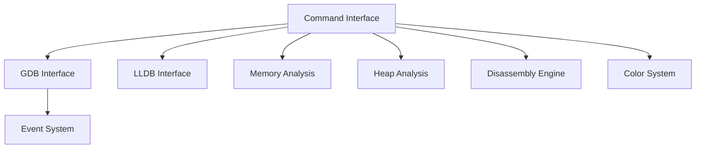

# pwndbg/pwndbg

> Extension GDB et LLDB qui enrichit le débogage bas niveau, pour ingénieurs système et rétro-ingénieurs.

## Le problème
GDB et LLDB nus sont peu ergonomiques pour l'analyse binaire : commandes verbeuses, peu d'information affichée par défaut.

## Ce que ça fait vraiment
Module Python chargé dans GDB, ou REPL pour LLDB. Il ajoute des commandes (hexdump, mémoire, tas, désassemblage), un affichage coloré, des composants TUI et un système de configuration et d'événements. Les couches `pwndbg/dbg/gdb/` et `pwndbg/dbg/lldb/` isolent chaque débogueur. Le support LLDB est décrit comme précoce et expérimental.

## Comment c'est branché

## Essayer
Aucune commande documentée dans l'extrait du README : il renvoie à une page d'installation externe. Compatibilité annoncée : GDB 12.1+ avec Python 3.10+ ; LLDB 19+ avec Python 3.12+.

## Coût et pièges
Gratuit. Il faut GDB ou LLDB installé dans une version compatible ; 219 issues ouvertes.

## Ce que ce n'est pas
Pas un débogueur autonome : il complète GDB/LLDB. Outil à double usage (analyse de binaires, développement d'exploits) mais d'usage courant en débogage légitime.

## Alternatives
- GEF : autre extension GDB, packagée en fichier unique.
- PEDA : extension GDB plus ancienne, fichier unique.
- gdbinit : script historique, fichier unique.

## Pour toi
À surveiller : précieux si tu déboggues du code natif (extensions C/C++ de bibliothèques ML, par exemple), mais hors du quotidien d'un profil data/MLOps.

