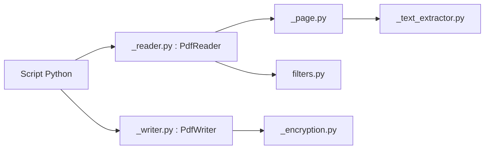

# py-pdf/pypdf

> Bibliothèque Python pure pour lire, découper, fusionner et transformer des PDF, et en extraire le texte.

## Le problème
Manipuler des PDF dans un script (extraire du texte, assembler des pages) sans dépendance binaire.

## Ce que ça fait vraiment
`PdfReader` ouvre un PDF et expose pages, texte et métadonnées ; `PdfWriter` crée ou modifie des PDF : fusion, découpage, rognage, transformations de pages, annotations, chiffrement et déchiffrement (extra `crypto` pour AES). La CLI `pdfly` s'appuie sur la bibliothèque.

## Comment c'est branché


## Essayer
```bash
pip install pypdf
pip install pypdf[crypto]
pytest
```
```python
from pypdf import PdfReader
reader = PdfReader("example.pdf")
text = reader.pages[0].extract_text()
```

## Coût et pièges
Gratuit. Pour de l'AES, installer l'extra `crypto`. La licence est « présente mais non identifiée par GitHub » : à confirmer.

## Ce que ce n'est pas
Pas un OCR : il extrait le texte intégré, pas celui des scans. Les PDF mal formés peuvent poser problème (d'où l'exigence d'un exemple minimal dans les issues).

## Alternatives
- pdfly : CLI fondée sur pypdf.

## Pour toi
À adopter : première brique pour ingérer des PDF dans un pipeline RAG, installable en une commande, avec une licence à confirmer.

