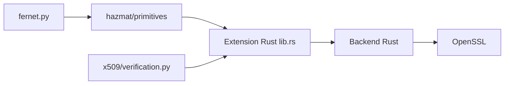

# pyca/cryptography

> Bibliothèque Python de cryptographie : recettes de haut niveau et primitives bas niveau.

## Le problème
Écrire du chiffrement correct à la main est dangereux ; il faut une base standard fiable.

## Ce que ça fait vraiment
Fernet (chiffrement symétrique authentifié), chiffres, hachages, KDF, clés asymétriques, sérialisation, X.509 avec vérification. Le code Python appelle un noyau Rust s'appuyant sur OpenSSL. Vise à être la « bibliothèque standard cryptographique » de Python.

## Comment c'est branché


## Essayer
```bash
pip install cryptography
```
```pycon
>>> from cryptography.fernet import Fernet
>>> key = Fernet.generate_key()
>>> f = Fernet(key)
>>> token = f.encrypt(b"A really secret message. Not for prying eyes.")
>>> f.decrypt(token)
```

## Coût et pièges
Gratuit. Compilation depuis les sources : Rust et OpenSSL requis ; les wheels évitent cela. Licence présente mais non identifiée par GitHub.

## Ce que ce n'est pas
Pas un gestionnaire de secrets ni une PKI clé en main.

## Alternatives
Aucune alternative nommée dans le README.

## Pour toi
Adopter : dépendance quasi incontournable pour chiffrer clés, jetons ou données dans un pipeline Python ; vérifier tout de même la mention de licence.

