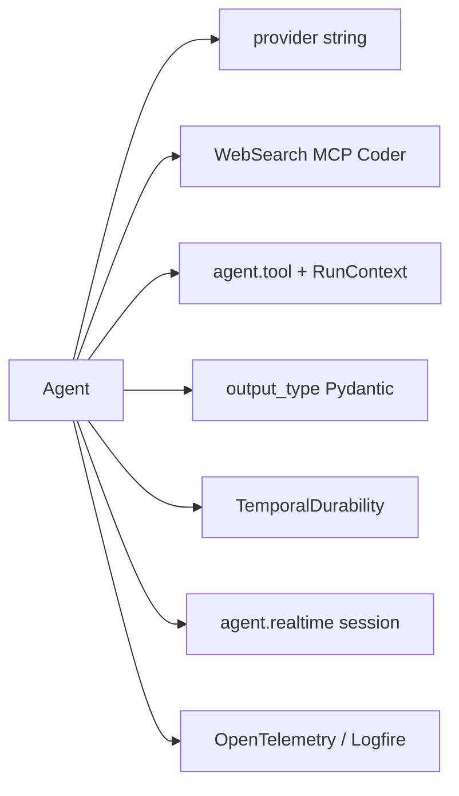

# pydantic/pydantic-ai

> SDK Python typé pour écrire des agents LLM, avec sortie validée et modèle interchangeable.

## Le problème
Un agent LLM renvoie du texte : ton code, lui, attend une structure, et découvre l'erreur à l'exécution.
Et changer de fournisseur oblige généralement à réécrire la boucle d'appel et les définitions d'outils.

## Ce que ça fait vraiment
Une boucle d'agent typée où le modèle se change par une chaîne : `'openai:gpt-5.6-sol'`, `'anthropic:claude-fable-5'`.
`output_type=Sentiment` garantit que `result.output` est une instance Pydantic validée.
Le décorateur `@agent.tool` transforme signature et docstring en schéma d'outil, avec un `RunContext` pour les dépendances.
Une même définition tourne en CLI, chat web, voix temps réel, GitHub Actions ou exécution durable.

## Comment c'est branché


## Essayer
```bash
uv add pydantic-ai
uvx --with pydantic-ai-harness clai -a pydantic_ai_harness.coder:coder_agent -m anthropic:claude-fable-5
```
Extras selon l'usage : `uv add "pydantic-ai[temporal]"`, `uv add "pydantic-ai[openai-realtime]"`,
`uv add pydantic-ai pydantic-ai-harness` pour l'agent de code.

## Coût et pièges
Chaque exécution consomme des jetons chez le fournisseur que tu choisis : la facture est à toi.
Un modèle `'test'` intégré permet de démarrer sans clé, mais ne remplace pas une vraie évaluation.

## Ce que ce n'est pas
Pas une plateforme : Logfire, le Gateway et Monty sont des produits distincts, la bibliothèque n'en dépend pas.
Pas un moteur de graphe ni un cadre d'évaluation : Pydantic Graph et Pydantic Evals sont des paquets séparés.
Pas un verrou fournisseur, mais pas non plus une garantie que chaque fonctionnalité existe chez tous les modèles.

## Alternatives
`LangChain`, `Google ADK`, `Claude Agent SDK` — cités dans la page de comparaisons du projet.
`Pydantic AI Harness` — si tu veux mémoire, garde-fous et sous-agents déjà assemblés.

## Pour toi
C'est le socle agent que je prendrais par défaut en Python : typage strict, et le modèle reste une variable.
