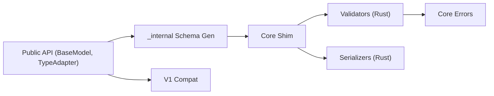

# pydantic/pydantic

> Bibliothèque Python de validation de données à partir des annotations de type, pour développeurs d'API et de pipelines.

## Le problème
Les données externes (JSON, formulaires, configs) arrivent sous forme de chaînes ou de types douteux. Sans validation, les erreurs surgissent tard et loin de leur cause.

## Ce que ça fait vraiment
Tu déclares un modèle avec des annotations de type ; Pydantic coerce et valide l'entrée, puis lève des erreurs structurées. En interne, le code Python construit un schéma de validation transmis à `pydantic-core`, une extension compilée en Rust qui valide et sérialise. Le README indique que la V1 reste disponible via `pydantic.v1` pour migrer par étapes.

## Comment c'est branché


## Essayer
```bash
pip install -U pydantic
```
```python
from pydantic import BaseModel

class User(BaseModel):
    id: int
    name: str = 'John Doe'

user = User(id='123')
```

## Coût et pièges
Gratuit. Passage V1 vers V2 : ruptures d'API à prévoir ; le README propose l'import `from pydantic import v1 as pydantic_v1`. 578 issues ouvertes.

## Ce que ce n'est pas
Ce n'est pas un ORM ni un framework web. Le README met en avant Logfire (produit d'observabilité de l'éditeur), qui est une offre distincte.

## Alternatives
- Aucune alternative nommée dans le README.

## Pour toi
Adopter : c'est la brique de validation standard des configs, des schémas d'API et des sorties de LLM en Python, la licence est MIT et le dépôt est activement poussé.

