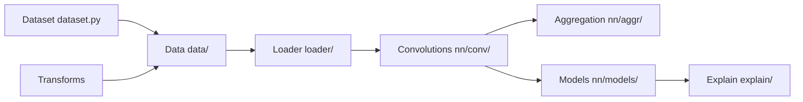

# pyg-team/pytorch_geometric

> Bibliothèque PyTorch pour construire et entraîner des réseaux de neurones sur graphes (GNN).

## Le problème
Les données en graphe (réseaux, molécules, nuages de points) ne rentrent pas dans les couches PyTorch classiques ; le message passing à la main est lent et fastidieux.

## Ce que ça fait vraiment
API `MessagePassing` pour écrire ses couches ; des dizaines de couches prêtes (GCN, GAT, SAGE, GIN, Transformer…) et de pooling.
Structures `Data`, datasets de benchmark, transforms, loaders de sous-échantillonnage (NeighborLoader, ClusterGCN, GraphSAINT).
Modèles complets (SchNet, Node2Vec, VGAE, GNNExplainer…) et graphes hétérogènes.
Support `torch.compile`, multi-GPU ; extensions C++/CUDA optionnelles (pyg-lib, torch-scatter).

## Comment c'est branché


## Essayer
```bash
pip install torch_geometric
pip install pyg-nightly
```

## Coût et pièges
Gratuit (MIT). Les extensions optionnelles doivent correspondre exactement aux versions PyTorch/CUDA. Python 3.10 à 3.14.

## Ce que ce n'est pas
Pas une base de données graphe ni un outil de visualisation. Pas indépendant de PyTorch.

## Alternatives
Aucune alternative nommée dans le README.

## Pour toi
Adopter : la référence pour tout projet GNN en PyTorch, installable sans dépendance native depuis la 2.3.
